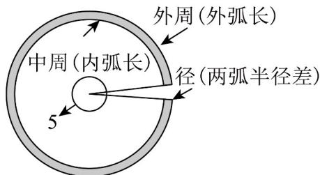

## 一、选择题：本题共8小题，每小题5分，共40分。在每小题给出的四个选项中，只有一项是符合题目要求的。

1. 《九章算术》是一部中国古代的数学专著。第一章《方田》主要讲各种形状的田地面积的计算方法，

其中将圆环或不足一匝的圆环形田地称为“环田”（注：匝，意为周，环绕一周叫一匝）书中提到如图所示

的一块“环田”：中周九十五步，外周一百二十五步，所在扇形的圆心角大小为 $^{5}$ （单位：弧度），则“该环

田”的面积为（）

A.600平方步 B.640平方步C.660平方步 D.700平方步

【答案】C

【详解】设中周的半径是 $R_{1}$ ，外周的半径是 $R_{2}$ ，圆心角为 $\alpha = 5$ ， $\left\{ \begin{array}{l} \alpha R_1 = 5R_1 = 95 \\ \alpha R_2 = 5R_2 = 125 \end{array} \right.$ 解得： $\left\{ \begin{array}{l} R_1 = 19 \\ R_2 = 25 \end{array} \right.$ 则“该环田”的面积为 $S = \frac{1}{2}\alpha R_2^2 -\frac{1}{2}\alpha R_1^2 = \frac{1}{2}\times 5\times (25^2 -19^2) = 660$ 平方步·

故选：C

2. “ $\theta=\frac{\pi}{6}$ ”是“ $\sin\theta=\frac{1}{2}$ ”的（）

【答案】
A．充分不必要条件
B．必要不充分条件
C．充要条件
D．既不充分也不必要条件

【答案】A

【详解】当 $\theta=\frac{\pi}{6}$ 时， $\sin\theta=\sin\frac{\pi}{6}=\frac{1}{2}$ ，充分性成立，

反过来，当 $\sin \theta = \frac{1}{2}$ 时， $\theta = \frac{\pi}{6} + 2k\pi, k \in \mathbb{Z}$ 或 $\theta = \frac{5\pi}{6} + 2k\pi, k \in \mathbb{Z}$ ，故必要性不成立，所以“ $\theta = \frac{\pi}{6}$ ”是“ $\sin \theta = \frac{1}{2}$ ”的充分不必要条件，

故选：A.

![[高中/课堂同步/题库/人教A版高中数学同步讲义(2026)/01_必修第一册/第五章 三角函数/第五章 三角函数（高效培优单元测试·强化卷）数学人教A版2019高一必修第一册/一_选择题/questions/Q00076497.md]]
![[高中/课堂同步/题库/人教A版高中数学同步讲义(2026)/01_必修第一册/第五章 三角函数/第五章 三角函数（高效培优单元测试·强化卷）数学人教A版2019高一必修第一册/一_选择题/questions/Q00076498.md]]
![[高中/课堂同步/题库/人教A版高中数学同步讲义(2026)/01_必修第一册/第五章 三角函数/第五章 三角函数（高效培优单元测试·强化卷）数学人教A版2019高一必修第一册/一_选择题/questions/Q00076499.md]]
![[高中/课堂同步/题库/人教A版高中数学同步讲义(2026)/01_必修第一册/第五章 三角函数/第五章 三角函数（高效培优单元测试·强化卷）数学人教A版2019高一必修第一册/一_选择题/questions/Q00076500.md]]
![[高中/课堂同步/题库/人教A版高中数学同步讲义(2026)/01_必修第一册/第五章 三角函数/第五章 三角函数（高效培优单元测试·强化卷）数学人教A版2019高一必修第一册/一_选择题/questions/Q00076501.md]]
![[高中/课堂同步/题库/人教A版高中数学同步讲义(2026)/01_必修第一册/第五章 三角函数/第五章 三角函数（高效培优单元测试·强化卷）数学人教A版2019高一必修第一册/一_选择题/questions/Q00076502.md]]
![[高中/课堂同步/题库/人教A版高中数学同步讲义(2026)/01_必修第一册/第五章 三角函数/第五章 三角函数（高效培优单元测试·强化卷）数学人教A版2019高一必修第一册/一_选择题/questions/Q00076503.md]]
![[高中/课堂同步/题库/人教A版高中数学同步讲义(2026)/01_必修第一册/第五章 三角函数/第五章 三角函数（高效培优单元测试·强化卷）数学人教A版2019高一必修第一册/一_选择题/questions/Q00076504.md]]
