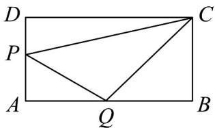

<!-- question-source:start -->
14．如图，矩形ABCD中，AB=3,BC=2，P,Q分别为边AD,AB上的点，若 $\angle PCQ=\frac{\pi}{4}$ ，则 $^{\triangle}APQ$ 的

面积的最大值为\_\_\_\_。

<!-- question-source:end -->

![[高中/课堂同步/题库/人教A版高中数学同步讲义(2026)/01_必修第一册/第五章 三角函数/第五章 三角函数（高效培优单元测试·强化卷）数学人教A版2019高一必修第一册/三_填空题/questions/answers/Q00076507A1.md]]
