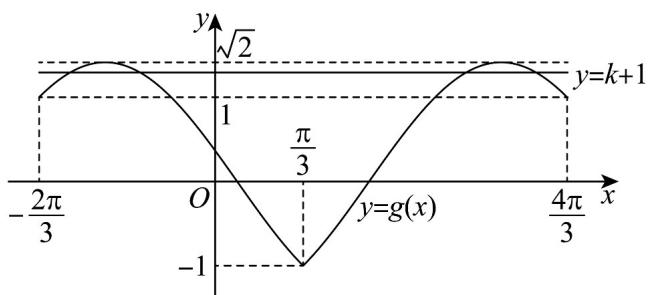

> [!faq]- 《第五章 三角函数（高效培优单元测试·强化卷）数学人教A版2019高一必修第一册》官方解析
>
> > [!success]- **【答案】** $[0,\sqrt{2}-1)$
>
> > [!note]- **【解析】**
> > 函数 $f(x) = \mathrm{e}^{|x - 1|} + \cos \pi x$ ，则 $f(x)$ 的图象关于 $x = 1$ 轴对称，且 $\mathrm{e}^{|x - 1|} = 1, \cos \pi x \in [-1, 1]$
> >
> > 因此 $f(x) = 0$ 有唯一解 $f(1) = 0$ ，则 $f(|\sin (x - \frac{\pi}{3})| - \cos (x - \frac{\pi}{3}) - k) = 0 = f(1)$
> >
> > 即 $|\sin (x - \frac{\pi}{3})| - \cos (x - \frac{\pi}{3}) - k = 1$ ，则 $k + 1 = |\sin (x - \frac{\pi}{3})| - \cos (x - \frac{\pi}{3})$
> >
> > 当 $x \in [-\frac{2\pi}{3}, \frac{4\pi}{3}]$ 时， $x - \frac{\pi}{3} \in [-\frac{7\pi}{6}, \pi]$ ，当 $x - \frac{\pi}{3} \in [-\frac{7\pi}{6}, 0]$ ，即 $x \in [-\frac{2\pi}{3}, \frac{\pi}{3}]$ 时，
> >
> > $$
> > k + 1 = - \sin (x - \frac {\pi}{3}) - \cos (x - \frac {\pi}{3}) = - \sqrt {2} \sin (x - \frac {\pi}{1 2})
> > $$
> >
> > 当 $x - \frac{\pi}{3} \in (0, \pi]$ ，即 $x \in (\frac{\pi}{3}, \frac{4\pi}{3}]$ 时， $k + 1 = \sin(x - \frac{\pi}{3}) - \cos(x - \frac{\pi}{3}) = \sqrt{2} \sin(x - \frac{7\pi}{12})$ ，
> >
> > 即 $k + 1 = \left\{ \begin{array}{l} \sqrt{2}\sin (x - \frac{7\pi}{12}), x \in (\frac{\pi}{3}, \frac{4\pi}{3}] \\ -\sqrt{2}\sin (x - \frac{\pi}{12}), x \in [-\frac{2\pi}{3}, \frac{\pi}{3}] \end{array} \right.$ ，令 $g(x) = \left\{ \begin{array}{l} \sqrt{2}\sin (x - \frac{7\pi}{12}), x \in (\frac{\pi}{3}, \frac{4\pi}{3}] \\ -\sqrt{2}\sin (x - \frac{\pi}{12}), x \in [-\frac{2\pi}{3}, \frac{\pi}{3}] \end{array} \right.$ ，
> >
> > 在同一坐标系内作出直线 $y = k + 1$ 与函数 $y = g(x)$ 的图象，如图：
> >
> > 
> >
> > 观察图象，当 $1 \leq k + 1 < \sqrt{2}$ ，即 $0 \leq k < \sqrt{2} - 1$ 时，直线 $y = k + 1$ 与函数 $y = g(x)$ 的图象有4个交点，
> >
> > 所以 $k$ 的取值范围为 $[0, \sqrt{2} - 1)$
> >
> > 故答案为： $[0, \sqrt{2} - 1)$
