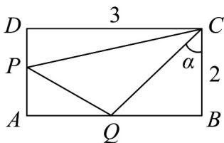

> [!faq]- 《第五章 三角函数（高效培优单元测试·强化卷）数学人教A版2019高一必修第一册》官方解析
>
> > [!success]- **【答案】** $\frac{37-20\sqrt{3}}{2}$
>
> > [!note]- **【解析】**
> > 解：设 $\angle BCQ = \alpha (0 < \alpha < \frac{\pi}{4})$
> >
> > 
> >
> > 则 $\angle DCP = \frac{\pi}{4} -\alpha$
> >
> > 则在 $\mathrm{Rt}\triangle BCQ$ 中，易知则 $BQ = 2\tan \alpha$
> >
> > 所以 $AQ = AB - BQ = 3 - 2 \tan \alpha$
> >
> > 在 $\mathrm{Rt}\triangle DCP$ 中，易知则 $DP = 3\tan (\frac{\pi}{4} -\alpha)$
> >
> > 所以 $AP = AQ - DP = 2 - 3\tan \left(\frac{\pi}{4} -\alpha\right)$
> >
> > 所以 $S_{\triangle APQ} = \frac{1}{2} AQ\cdot AP = \frac{1}{2} (3 - 2\tan \alpha)\times [2 - 3\tan (\frac{\pi}{4} -\alpha)]$
> >
> > $$
> > = \frac {1}{2} (3 - 2 \tan \alpha) \times (2 - 3 \times \frac {1 - \tan \alpha}{1 + \tan \alpha})
> > $$
> >
> > $$
> > = \frac {1}{2} (3 - 2 \tan \alpha) \times \frac {5 \tan \alpha - 1}{1 + \tan \alpha}
> > $$
> >
> > $$
> > = \frac {1}{2} (3 - 2 \tan \alpha) \times \frac {5 (\tan \alpha + 1) - 6}{\tan \alpha + 1}
> > $$
> >
> > $$
> > = \frac {1}{2} [ - 2 (\tan \alpha + 1) + 5 ] \times (5 - \frac {6}{\tan \alpha + 1}),
> > $$
> >
> > 令 $t = \tan \alpha + 1$
> >
> > 因为 $0 < \alpha < \frac{\pi}{4}$ ，所以 $t = \tan \alpha + 1 \in (1,2)$ ，
> >
> > 所以 $S_{\triangle APQ} = \frac{1}{2} (-2t + 5)\times (5 - \frac{6}{t})$
> >
> > $$
> > = \frac {1}{2} (- 2 t + 5) \times (5 - \frac {6}{t})
> > $$
> >
> > $$
> > = \frac {1}{2} [ 3 7 - 1 0 (t + \frac {3}{t}) ]
> > $$
> >
> > 因为 $t + \frac{3}{t} 2\sqrt{t \cdot \frac{3}{t}} = 2\sqrt{3}$
> >
> > 当且仅当 $t = \frac{3}{t}, t = \sqrt{3} \in (1,2)$ 时，等号成立，
> >
> > 所以 $-10(t + \frac{3}{t})\leq -20\sqrt{3}$ ， $t = \sqrt{3}$ 时等号成立，
> >
> > 所以 $S_{\triangle APQ} = \frac{1}{2}[37 - 10(t + \frac{3}{t})] \leq \frac{1}{2}(37 - 20\sqrt{3}) = \frac{37 - 20\sqrt{3}}{2}$ .
> >
> > 故答案为： $\frac{37-20\sqrt{3}}{2}$
