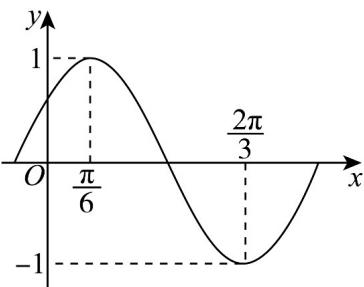

<!-- question-source:start -->
18. 已知函数 $f(x) = A \sin (\omega x + \varphi) \left( \omega > 0, |\varphi| < \frac{\pi}{2} \right)$ 部分图象如图所示.

(1)求 $\omega$ 和 $\varphi$ 的值；

(2)求函数 $f(x)$ 在 $[0,\pi]$ 上的单调递增区间；

(3)将 $f(x)$ 向右平移 $\frac{\pi}{4}$ 个单位长度得到函数 $\varphi (x)$ ，已知函数 $g(x) = 2\varphi^2 (x) - 3\varphi (x) + 2a - 1$ 在 $\left[\frac{\pi}{6},\frac{\pi}{2}\right]$ 上存在

零点，求实数 $a$ 的最小值和最大值.
<!-- question-source:end -->

![[高中/课堂同步/题库/人教A版高中数学同步讲义(2026)/01_必修第一册/第五章 三角函数/第五章 三角函数（高效培优单元测试·强化卷）数学人教A版2019高一必修第一册/四_解答题/questions/answers/Q00076511A1.md]]
