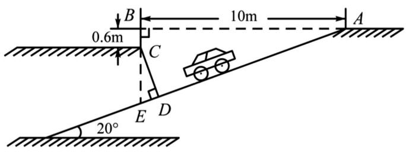
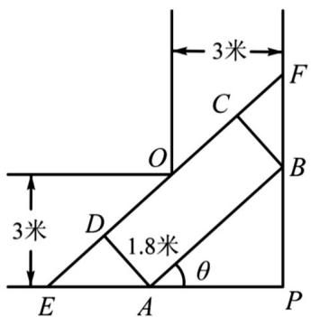

> [!faq]- 《第五章 三角函数（高效培优单元测试·强化卷）数学人教A版2019高一必修第一册》官方解析
>
> > [!success]- **【答案】** (1) $\omega = 2$ ， $\varphi = \frac{\pi}{6}$ (2) $\left[0, \frac{\pi}{6}\right]$ , $\left[\frac{2\pi}{3}, \pi\right]$ (3)最小值为 $\frac{1}{2}$ ，最大值为 $\frac{17}{16}$
>
> > [!note]- **【解析】**
> > （1）由图象可知： $\frac{T}{2} = \frac{2\pi}{3} -\frac{\pi}{6} = \frac{\pi}{2}$ ，所以 $T = \pi$ ，则 $\omega = \frac{2\pi}{T} = 2$
> >
> > 又 $2 \times \frac{\pi}{6} + \varphi = 2k\pi + \frac{\pi}{2}$ ， $k \in \mathbf{Z}$ ，得 $\varphi = 2k\pi + \frac{\pi}{6}$
> >
> > 又 $\left|\varphi\right|<\frac{\pi}{2}$ ，所以 $\varphi=\frac{\pi}{6}$ .
> >
> > (2) 由 (1) 知 $f(x) = \sin \left(2x + \frac{\pi}{6}\right)$
> >
> > 令 $2k\pi - \frac{\pi}{2} \leq 2x + \frac{\pi}{6} \leq 2k\pi + \frac{\pi}{2}$ ， $k \in \mathbf{Z}$ ，
> >
> > 解得： $k\pi - \frac{\pi}{3} \leq x \leq k\pi + \frac{\pi}{6}$ ， $k \in Z$ .
> >
> > 令 $k = 0$ ，得 $-\frac{\pi}{3} \leq x \leq \frac{\pi}{6}$ ，因 $0 \leq x \leq \pi$ ，则 $0 \leq x \leq \frac{\pi}{6}$
> >
> > 令 $k = 1$ ，得 $\frac{2\pi}{3} \leq x \leq \frac{7\pi}{6}$ ，因 $0 \leq x \leq \pi$ ，则 $\frac{2\pi}{3} \leq x \leq \pi$
> >
> > 所以 $f(x)$ 在 $[0,\pi ]$ 上的单调递增区间为 $\left[0,\frac{\pi}{6}\right]$ ， $\left[\frac{2\pi}{3},\pi\right]$
> >
> > （3）由题意， $\varphi (x) = f\left(x - \frac{\pi}{4}\right) = \sin \left[2\left(x - \frac{\pi}{4}\right) + \frac{\pi}{6}\right] = \sin \left(2x - \frac{\pi}{3}\right)$
> >
> > 则 $g(x) = 2\sin^2\left(2x - \frac{\pi}{3}\right) - 3\sin \left(2x - \frac{\pi}{3}\right) + 2a - 1$
> >
> > 由函数 $g(x)$ 在 $\left[\frac{\pi}{6},\frac{\pi}{2}\right]$ 上存在零点，
> >
> > 则 $2a = -2\sin^2\left(2x - \frac{\pi}{3}\right) + 3\sin \left(2x - \frac{\pi}{3}\right) + 1$ 在 $x\in \left[\frac{\pi}{6},\frac{\pi}{2}\right]$ 上有解，
> >
> > 令 $t = \sin \left(2x - \frac{\pi}{3}\right)$ ，由 $x\in \left[\frac{\pi}{6},\frac{\pi}{2}\right]$ ，则 $2x - \frac{\pi}{3}\in \left[0,\frac{2\pi}{3}\right]$ ，即 $t\in [0,1]$
> >
> > $$
> > y = - 2 t ^ {2} + 3 t + 1 = - 2 \left(t - \frac {3}{4}\right) ^ {2} + \frac {1 7}{8} \in \left[ 1, \frac {1 7}{8} \right]
> > $$
> >
> > 所以 $1 \leq 2a \leq \frac{17}{8}$ ，即 $\frac{1}{2} \leq a \leq \frac{17}{16}$
> >
> > 故 a 最小值为 $\frac{1}{2}$ ，最大值为 $\frac{17}{16}$ .
> >
> > 19. 随着私家车的逐渐增多，居民小区“停车难”问题日益突出。本市某居民小区为缓解“停车难”问题，拟建
> >
> > 造地下停车库，建筑设计师提供了该地下停车库的入口和进入后的直角转弯处的平面设计示意图。
> >
> > 
> > 图1
> >
> > 
> > 图2
> >
> > (1)按规定，地下停车库坡道口上方要张贴限高标志，以便告知停车人车辆能否安全驶入，为标明限高，请
> >
> > 你根据该图 $^{1}$ 所示数据计算限定高度 CD 的值．（精确到 0.1m）（下列数据提供参考： $\sin 20^{\circ}=0.3420$
> >
> > $$
> > \cos 2 0 ^ {\circ} = 0. 9 3 9 7 \quad , \tan 2 0 ^ {\circ} = 0. 3 6 4 0 \tag {1}
> > $$
> >
> > (2)在车库内有一条直角拐弯车道，车道的平面图如图 $^{2}$ 所示，车道宽为 $^{3}$ 米，现有一辆转动灵活的小汽车。
> >
> > 在其水平截面图为矩形 $ABCD$ ，它的宽 $AD$ 为1.8米，直线 $CD$ 与直角车道的外壁相交于 $E$ 、 $F$ ：
> > - **①**：若小汽车卡在直角车道内（即 A、B 分别在 PE、PF 上，点 O 在 CD 上） $\angle PAB = \theta$ （rad），求水平截面
> >
> > 的长（即 AB 的长，用 $\theta$ 表示）
> > - **②**：若小汽车水平截面的长为 $^{4.4}$ 米，问此车是否能顺利通过此直角拐弯车道？
> >
> > 【答案】(1)2.8m；
> >
> > (2)① $\frac{3(\sin\theta + \cos\theta) - 1.8}{\sin\theta\cos\theta}$ ， $0 < \theta < \frac{\pi}{2}$ ；
> > - **②**：小汽车能够顺利通过直角转弯车道·
> >
> > 【详解】（1）图1中：在 $\triangle ABE$ 中， $\angle ABE = 90^{\circ}$ ， $\angle BAE = 20^{\circ}$ ， $\tan \angle BAE = \frac{BE}{AB}$ ，又 $AB = 10$
> >
> > 则 $BE = AB \cdot \tan \angle BAE = 10\tan 20^{\circ} = 3.640(\mathrm{m})$ ，而 $BC = 0.6\mathrm{m}$ ，有 $CE = BE - BC = 3.040(\mathrm{m})$
> >
> > 在 $\triangle CED$ 中， $CD\perp AE$ ， $\angle ECD = \angle BAE = 20^{\circ}$ ， $\cos \angle ECD = \frac{CD}{CE}$
> >
> > $$
> > \text {则} C D = C E \cdot \cos \angle E C D = 3. 0 4 0 \cos 2 0 ^ {\circ} = 3. 0 4 0 \times 0. 9 3 9 7 \approx 2. 8 5 7 6 (\mathrm{m})
> > $$
> >
> > 结合实际意义，四舍五入会使车辆卡住，可以使用去尾法，则 $CD \approx 2.8m$ ，
> >
> > 所以限定高度 CD 的值约为 2.8m.
> >
> > (2) ①图 $^{2}$ 中：依题意，则
> >
> > $$
> > E F = O E + O F = \frac {3}{\cos \theta} + \frac {3}{\sin \theta} \quad 0 <   \theta <   \frac {\pi}{2} \quad D E = \frac {1 . 8}{\tan \theta}
> > $$
> >
> > $$
> > C F = B C \cdot \tan \theta = 1. 8 \tan \theta
> > $$
> >
> > 又 AB = DC = EF - (DE + CF)，设 $AB = f(\theta)$ ，
> >
> > $$
> > f (\theta) = \frac {3}{\cos \theta} + \frac {3}{\sin \theta} - 1. 8 \left(\tan \theta + \frac {1}{\tan \theta}\right) = \frac {3}{\cos \theta} + \frac {3}{\sin \theta} - 1. 8 \left(\frac {\sin \theta}{\cos \theta} + \frac {\cos \theta}{\sin \theta}\right) = \frac {3 (\sin \theta + \cos \theta) - 1 . 8}{\sin \theta \cos \theta}, 0 <   \theta <   \frac {\pi}{2};
> > $$
> > - **②**：由①知，设 $\sin \theta +\cos \theta = t$ ，则 $t = \sqrt{2}\sin (\theta +\frac{\pi}{4})$ ， $1 <   t\leq \sqrt{2}$ ， $\sin \theta \cos \theta = \frac{t^2 - 1}{2}$
> >
> > 则
> >
> > $$
> > f (\theta) = g (t) = \frac {6 t - 3 . 6}{t ^ {2} - 1} = \frac {6 \left(t - \frac {3}{5}\right)}{t ^ {2} - 1} = \frac {6}{\frac {t ^ {2} - 1}{t - \frac {3}{5}}} = \frac {6}{\left(t - \frac {3}{5}\right) - \frac {\frac {1 6}{2 5}}{t - \frac {3}{5}} + \frac {6}{5}},
> > $$
> >
> > 而 $\quad t\in(1,\sqrt{2}]$ ，函数 $u=(t-\frac{3}{5})-\frac{\frac{16}{25}}{t-\frac{3}{5}}+\frac{6}{5}$ 在 $\quad(1,\sqrt{2}]$ 上单调递增，则 $g(t)=\frac{6t-3.6}{t^{2}-1}$ 在 $\left(1,\sqrt{2}\right]$ 上是减函数，于是得当 $t=\sqrt{2}$ ，即 $\theta=\frac{\pi}{4}$ 时， $g(t)_{\min}=g(\sqrt{2})=6\sqrt{2}-3.6>4.4$ ，
> >
> > 所以小汽车能够顺利通过直角转弯车道·
