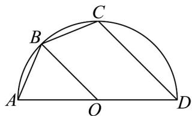

<!-- question-source:start -->
8. 如图， $AD$ 是半径为 $4$ 的半圆 $O$ 的直径，点 $B$ ， $C$ 在弧 $AD$ 上，若 $AB = BC$ ，则四边形 $BCDO$ 周长的最

大值为（）

A. 16 B. 17 C. 18 D. 19
<!-- question-source:end -->

![[高中/课堂同步/题库/人教A版高中数学同步讲义(2026)/01_必修第一册/第五章 三角函数/第五章 三角函数（高效培优单元测试·提升卷）数学人教A版2019高一必修第一册/一_选择题/questions/answers/Q00076517A1.md]]
