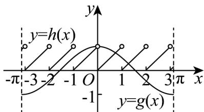

> [!faq]- 《第五章 三角函数（高效培优单元测试·提升卷）数学人教A版2019高一必修第一册》官方解析
>
> > [!success]- **【答案】** A
>
> > [!note]- **【解析】**
> > 由 $f(x)=0$ ，得 $\cos x=x-[x]$ ，令函数 $g(x)=\cos x$ 与 $h(x)=x-[x]$ ，
> >
> > 依题意，所求问题即为函数 $y = g(x)$ 与 $y = h(x)$ 在 $[- \pi, \pi]$ 上的交点个数，
> >
> > 在同一坐标系内作出函数 $y = g(x)$ 与 $y = h(x)$ 在 $[- \pi, \pi]$ 上的图象，
> >
> > 
> >
> > 观察图象得函数 $y = g(x)$ 与 $y = h(x)$ 在 $[- \pi, \pi]$ 上的图象有2个交点，
> >
> > 所以函数 $f(x)$ 在区间 $\left[-\pi, \pi\right]$ 上的零点个数为 2.
> >
> > 故选 **A**
