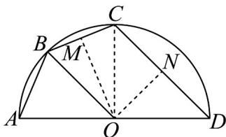

> [!faq]- 《第五章 三角函数（高效培优单元测试·提升卷）数学人教A版2019高一必修第一册》官方解析
>
> > [!success]- **【答案】** B
>
> > [!note]- **【解析】**
> > 取 $BC, CD$ 的中点 $M, N$ ，连接 $OM, ON, OB, OC$
> >
> > 则 $OM \perp BC$ ， $ON \perp CD$
> >
> > 因为 $AB = BC$ ，所以 $\overline{AB} = \overline{BC}$ ， $\angle BOC = \angle AOB$
> >
> > 因为 OB = OC ，所以 $\angle OCB = \angle OBC$
> >
> > 设 $\angle AOB = \theta$ ， $0 <   \theta <  \frac{\pi}{2}$ ，则 $\angle BOM = \frac{\theta}{2}$ ， $\angle CON = \frac{\pi}{2} -\theta$
> >
> > $CN = DN = 4\sin \left(\frac{\pi}{2} -\theta\right) = 4\cos \theta$ $CM = BM = 4\sin \frac{\theta}{2}$ 故
> >
> > $BO + CD + BC + OD = 8 + 8\sin \frac{\theta}{2} + 8\cos \theta = 8\sin \frac{\theta}{2} + 8\left(1 - 2\sin^{2} \frac{\theta}{2}\right) + 8$ 故
> >
> > $$
> > = - 1 6 \sin^ {2} \frac {\theta}{2} + 8 \sin \frac {\theta}{2} + 1 6 = - 1 6 \left(\sin \frac {\theta}{2} - \frac {1}{4}\right) ^ {2} + 1 7
> > $$
> >
> > 因为 $0 < \theta < \frac{\pi}{2}$ ，所以 $0 < \frac{\theta}{2} < \frac{\pi}{4}$ ， $0 < \sin \frac{\theta}{2} < \frac{\sqrt{2}}{2}$
> >
> > 故当 $\sin\frac{\theta}{2}=\frac{1}{4}$ 时， $-16\left(\sin\frac{\theta}{2}-\frac{1}{4}\right)^{2}+17$ 取得最大值，最大值为 17.
> >
> > 
> >
> > 故选：B
> >
> > ## 二、选择题：本题共3小题，每小题6分，共18分．在每小题给出的选项中，有多项符合题目要求．全部选对的得6分，部分选对的得部分分，有选错的得0分.
