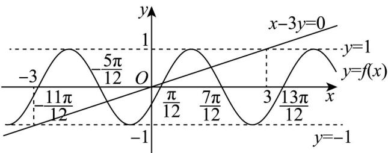

> [!faq]- 《第五章 三角函数（高效培优单元测试·提升卷）数学人教A版2019高一必修第一册》官方解析
>
> > [!success]- **【答案】** A. 函数 $f(x)$ 的最小正周期为 $\pi$ B. $(\frac{\pi}{12},0)$ 是 $f(x)$ 的一个对称中心 C. 函数 $f(x)$ 在 $\left(0,\frac{\pi}{2}\right)$ 上单调递增 D. 函数 $y=f(x)-\frac{1}{2}$ 图象与直线 x-3y=0 有 3 个交点
>
> > [!note]- **【解析】**
> > A选项， $f(x)=\sqrt{3}\sin x\cos x+\sin^{2}x=\frac{\sqrt{3}}{2}\sin 2x+\frac{1-\cos 2x}{2}=\frac{\sqrt{3}}{2}\sin 2x-\frac{\cos 2x}{2}+\frac{1}{2}=\sin\left(2x-\frac{\pi}{6}\right)+\frac{1}{2}$
> >
> > 故 $f(x)$ 的最小正周期为 $\frac{2\pi}{2}=\pi$ ，A正确；
> >
> > B 选项， $f\left(\frac{\pi}{12}\right)=\sin\left[2\times\left(\frac{\pi}{12}\right)-\frac{\pi}{6}\right]+\frac{1}{2}=\frac{1}{2}$ ，故 $(\frac{\pi}{12},0)$ 不是 $f(x)$ 的一个对称中心，B 错误；
> >
> > C 选项， $x \in \left(0, \frac{\pi}{2}\right)$ ，令 $z = 2x - \frac{\pi}{6} \in \left(-\frac{\pi}{6}, \frac{5\pi}{6}\right)$
> >
> > 由于 $y = \sin z$ 在 $z \in \left(-\frac{\pi}{6}, \frac{5\pi}{6}\right)$ 上不单调，故 $f(x)$ 在 $\left(0, \frac{\pi}{2}\right)$ 上不单调，C 错误；
> >
> > D 选项，同一坐标系内画出 $f(x)-\frac{1}{2}=\sin\left(2x-\frac{\pi}{6}\right)$ 与 x-3y=0 ，如下：
> >
> > 
> >
> > 可以看出两函数有 $^{3}$ 个交点，D正确。
> >
> > 故选 **AD**
