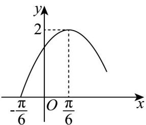

<!-- question-source:start -->
15. 已知函数 $f(x) = A \sin (\omega x + \varphi) \left( A > 0, \omega > 0, 0 < \varphi < \frac{\pi}{2} \right)$ 的部分图象如图所示.

(1)求 $f(x)$ 的解析式；

(2)函数 $f(x)$ 在 $x\in \left[-\frac{\pi}{6},\frac{\pi}{3}\right]$ 上的最大值，并确定此时 $x$ 的值.
<!-- question-source:end -->

![[高中/课堂同步/题库/人教A版高中数学同步讲义(2026)/01_必修第一册/第五章 三角函数/第五章 三角函数（高效培优单元测试·提升卷）数学人教A版2019高一必修第一册/三_填空题/questions/answers/Q00076524A1.md]]
