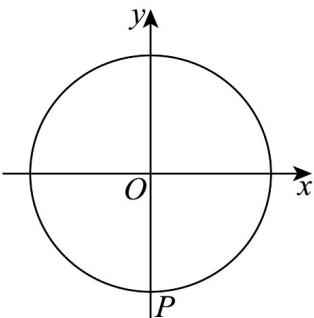
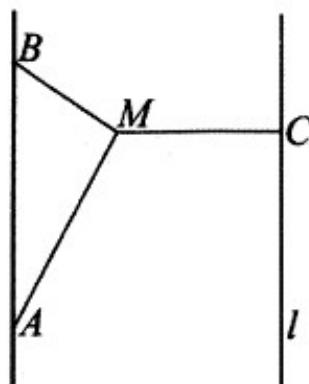
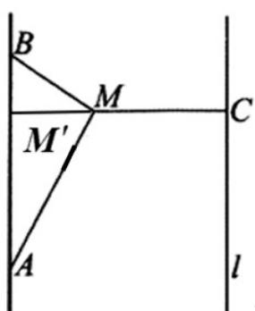

> [!faq]- 《第五章 三角函数（高效培优单元测试·提升卷）数学人教A版2019高一必修第一册》官方解析
>
> > [!success]- **【答案】** (1) $g\left(\frac{\pi}{3}\right)=2$ ， $\left[-\frac{2\pi}{3}+2k\pi,\frac{\pi}{3}+2k\pi\right]$ ， $k\in Z$ $$ \left(2\right) \left[ \frac {\pi}{6} + k \pi , \frac {\pi}{2} + k \pi \right] \quad , \quad k \in \mathbb {Z}. $$
>
> > [!note]- **【解析】**
> > （1）因为 $g(x) = \sin \left(x + \frac{\pi}{6}\right) + \sin \left(x - \frac{\pi}{6}\right) + 2\cos^2\frac{x}{2} -1$
> >
> > $$
> > = \sin x \cdot \cos \frac {\pi}{6} + \cos x \cdot \sin \frac {\pi}{6} + \sin x \cdot \cos \frac {\pi}{6} - \cos x \cdot \sin \frac {\pi}{6} + \cos x = \sqrt {3} \sin x + \cos x,
> > $$
> >
> > 所以 $g(x)=2\sin\left(x+\frac{\pi}{6}\right)$
> >
> > 故 $g\left(\frac{\pi}{3}\right)=2\sin\frac{\pi}{2}=2$
> >
> > 由 $-\frac{\pi}{2} + 2k\pi \leq x + \frac{\pi}{6} \leq \frac{\pi}{2} + 2k\pi$ ， $k \in \mathbb{Z}$ ，
> >
> > 解得 $-\frac{2\pi}{3}+2k\pi\leq x\leq\frac{\pi}{3}+2k\pi$ ， $k\in Z$ .
> >
> > 所以函数 $g(x)$ 的单调递增区间为 $\left[-\frac{2\pi}{3} + 2k\pi, \frac{\pi}{3} + 2k\pi\right]$ ， $k \in \mathbb{Z}$ .
> >
> > (2) 将函数 $y = \mathrm{g}(x)$ 图象上所有点向右平移 3 个单位长度，得：
> >
> > 再将 $y = 2\sin\left(x - \frac{\pi}{6}\right)$ 的图象横坐标缩短为原来的 $\frac{1}{2}$ ，纵坐标不变，得 $y = 2\sin\left(2x - \frac{\pi}{6}\right)$ .
> >
> > 所以函数 $f(x) = 2\sin \left(2x - \frac{\pi}{6}\right)$
> >
> > 由 $f(x)$ 1，得： $\sin\left(2x-\frac{\pi}{6}\right)$ $\frac{1}{2} \Rightarrow 2k\pi + \frac{\pi}{6} \leq 2x - \frac{\pi}{6} \leq 2k\pi + \frac{5\pi}{6}$ ， $k \in Z$ .
> >
> > 解得 $\frac{\pi}{6} + k\pi \leq x \leq \frac{\pi}{2} + k\pi$ ， $k \in \mathbb{Z}$ ，
> >
> > 所以函数 $f(x)$ 1的解集为 $\left[\frac{\pi}{6} + k\pi, \frac{\pi}{2} + k\pi\right]$ ， $k \in \mathbb{Z}$ .
> >
> > 18. 摩天轮是一种大型转轮状的机械建筑设施，游客坐在摩天轮的座舱里慢慢地往上转，可以从高处俯瞰
> >
> > 四周景色·某市的摩天轮最高点距离地面的高度为 $160\mathrm{m}$ ，转盘直径为 $152\mathrm{m}$ ，设有60个座舱，开启后按逆
> >
> > 时针方向匀速转动，游客在座舱转到距离地面最近的位置进舱，转一周约需要 $30\mathrm{min}$ ·游客甲坐上摩天轮的
> >
> > 座舱，开始转动 $t\mathrm{min}$ 后，距离地面的高度为 $H\mathrm{m}\cdot$
> >
> > (1)在转动一周的过程中，求 $H$ 关于 $t$ 的函数关系式；
> >
> > (2)求游客甲在开始转动 $25\mathrm{min}$ 后距离地面的高度；
> >
> > (3)当游客距离地面的高度不低于 $122\mathrm{m}$ 时，可以俯瞰该市的全景，求游客甲在摩天轮转动一周的过程中能
> >
> > 俯瞰该市全景的时长·
> >
> > 【答案】(1) $H = 76\sin \left(\frac{\pi}{15} t - \frac{\pi}{2}\right) + 84$ ， $0 \leq t \leq 30$
> >
> > (2)46m.
> >
> > (3)10 分钟
> >
> > 【详解】（1）设游客甲乘坐的座舱距离地面最近的位置为点 $P$ ，以摩天轮的轴心 $O$ 为原点，与地面平行的
> >
> > 直线为 x 轴建立平面直角坐标系，
> >
> > 
> >
> > 当 $t = 0$ 时， $H = 8$ ，此时 $P(0, -76)$ ，以 $OP$ 为终边的角是 $-\frac{\pi}{2}$
> >
> > 因为该摩天轮转一周约需要 $30\mathrm{min}$ ，该摩天轮的角速度约为 $\frac{2\pi}{30} = \frac{\pi}{15}\mathrm{rad / min}$
> >
> > 所以 $H = 76\sin\left(\frac{\pi}{15}t - \frac{\pi}{2}\right) + 84$ ， $0 \leq t \leq 30$
> >
> > (2) 当 t = 25 时， $H = 76 \sin \left( \frac{\pi}{15} \times 25 - \frac{\pi}{2} \right) + 84 = 46$
> >
> > 即游客甲在开始转动 25min 后距离地面的高度约为 46m·
> >
> > (3) 由题意可得 $76\sin\left(\frac{\pi}{15}t-\frac{\pi}{2}\right)+84$ 122，即 $\sin\left(\frac{\pi}{15}t-\frac{\pi}{2}\right)$ $\frac{1}{2}$
> >
> > 因为 $0 \leq t \leq 30$ ，所以 $-\frac{\pi}{2} \leq \frac{\pi}{15} t - \frac{\pi}{2} \leq \frac{3\pi}{2}$ ，
> >
> > 所以 $\frac{\pi}{6} \leq \frac{\pi}{15} t - \frac{\pi}{2} \leq \frac{5\pi}{6}$ ，解得 $10 \leq t \leq 20$ ，
> >
> > 则游客甲在摩天轮转动一周的过程中能俯瞰该市全景的时长为 $20 - 10 = 10 \, min$ .
> >
> > 19. 2024年政府工作报告中提出，加快新质生产力，积极打造低空经济·某市积极响应国家号召，不断探
> >
> > 索低空经济发展新模式，引进新型无人机开展物流运输·该市现有相距 $100\mathrm{km}$ 的 $A$ ， $B$ 两集散点到海岸线 $l(l$
> >
> > 为直线)距离均为 $75\sqrt{3}\mathrm{km}$ (如图)，计划在海岸线 $l$ 上建造一个港口 $C$ ，在 $A$ ， $B$ 两集散点及港口 $C$ 间开展
> >
> > 无人机物流运输·由于该无人机最远运输距离为 $50\sqrt{3}\mathrm{km}$ ，需在 $A$ ， $B$ ， $C$ 之间设置补能点 $M$ （无人机需经过
> >
> > 补能点 M 更换电池），且 $MC \perp l$ ， $\angle AMB = \frac{\pi}{2}$ 。设 $\angle MAB = \theta$ 。
> >
> > 
> >
> > (1) 当 $\theta = \frac{\pi}{6}$ 时，求无人机从 A 到 C 运输航程 $\left|MA\right| + \left|MC\right|$ 的值；
> >
> > (2)求 $\left|MA\right|+\left|MB\right|+\left|MC\right|$ 的取值范围.
> >
> > 【答案】(1) $100\sqrt{3}$
> >
> > (2) $\left[100\sqrt{2} + 75\sqrt{3} - 50, 100\sqrt{3} + 50\right]$ .
> >
> > 【详解】（1）
> >
> > 
> >
> > 当 $\theta = \frac{\pi}{6}$ 时， $|MA| = 100 \cdot \cos \frac{\pi}{6} = 50\sqrt{3} km$ ，作 $MM' \perp AB$ ，
> >
> > 则 $\left|MM'\right|=25\sqrt{3}km$ ，所以 $\left|MC\right|=75\sqrt{3}-25\sqrt{3}=50\sqrt{3}km$
> >
> > 故从 A 到 C 运输航程 $\left|MA\right| + \left|MC\right| = 100\sqrt{3}km$ ;
> >
> > (2) 由已知 $\left|MA\right|=100\cdot\cos\theta,\quad\left|MB\right|=100\cdot\sin\theta$
> >
> > $$
> > \left| M M ^ {\prime} \right| = \frac {\left| M A \right| \left| M B \right|}{\left| A B \right|} = 1 0 0 \sin \theta \cos \theta , \left| M C \right| = 7 5 \sqrt {3} - 1 0 0 \sin \theta \cos \theta ,
> > $$
> >
> > 因为无人机最远运输距离为 $50 \sqrt{3} km$
> >
> > 所以 $\left\{ \begin{array}{l} |MA| = 100 \cdot \cos \theta \leq 50\sqrt{3} \\ |MB| = 100 \cdot \sin \theta \leq 50\sqrt{3} \\ |MC| = 75\sqrt{3} - 100\sin \theta \cos \theta \leq 50\sqrt{3} \end{array} \right.$
> >
> > 所以 $\theta \in \left[\frac{\pi}{6},\frac{\pi}{3}\right]$
> >
> > $$
> > \left| M A \right| + \left| M B \right| + \left| M C \right| = 1 0 0 \cos \theta + 1 0 0 \sin \theta + 7 5 \sqrt {3} - 1 0 0 \sin \theta \cos \theta = 1 0 0 (\cos \theta + \sin \theta) + 7 5 \sqrt {3} - 1 0 0 \sin \theta \cos \theta
> > $$
> >
> > 令 $t = \cos \theta +\sin \theta$ ， $\cos \theta +\sin \theta = \sqrt{2}\sin \left(\theta +\frac{\pi}{4}\right)$
> >
> > 因为 $\theta +\frac{\pi}{4}\in \left[\frac{5\pi}{12},\frac{7\pi}{12}\right]$ ，所以 $t\in \left[\frac{\sqrt{3} + 1}{2},\sqrt{2}\right]$
> >
> > $$
> > \left| M A \right| + \left| M B \right| + \left| M C \right| = 1 0 0 t - 5 0 (t ^ {2} - 1) + 7 5 \sqrt {3} = - 5 0 t ^ {2} + 1 0 0 t + 5 0 + 7 5 \sqrt {3} = - 5 0 (t - 1) ^ {2} + 1 0 0 + 7 5 \sqrt {3}
> > $$
> >
> > 当 $t = \frac{\sqrt{3} + 1}{2}$ 时， $(|MA| + |MB| + |MC|)_{\max} = 100\sqrt{3} + 50$
> >
> > 当 $t = \sqrt{2}$ 时， $(|MA| + |MB| + |MC|)_{\min} = 100\sqrt{2} + 75\sqrt{3} - 50$
> >
> > 故 $\left|MA\right|+\left|MB\right|+\left|MC\right|$ 的范围是 $\left[100\sqrt{2}+75\sqrt{3}-50,100\sqrt{3}+50\right]$ .
