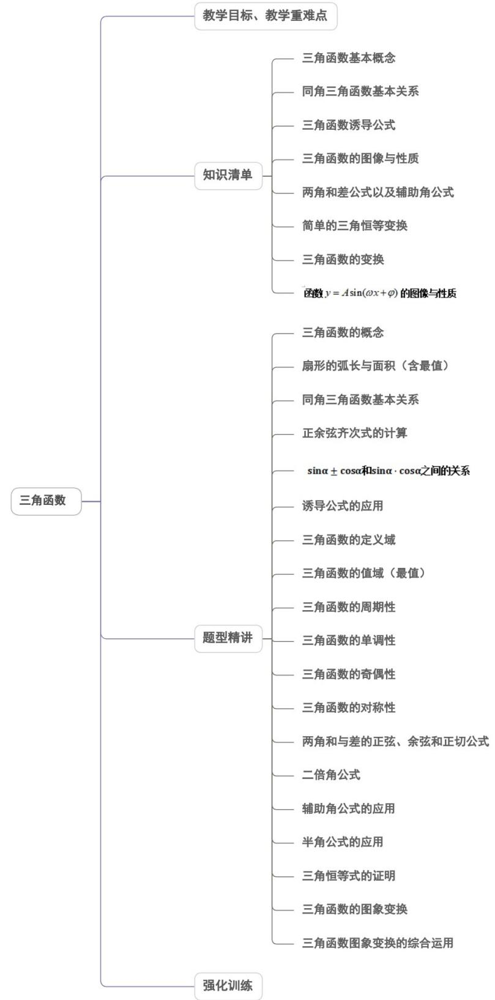
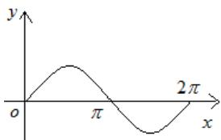
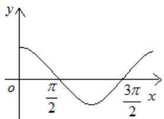
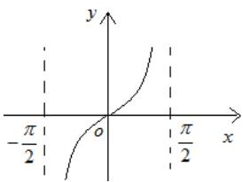
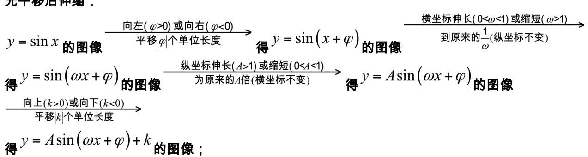
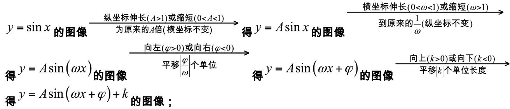
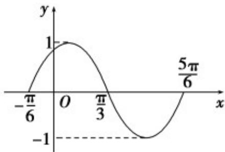
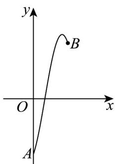
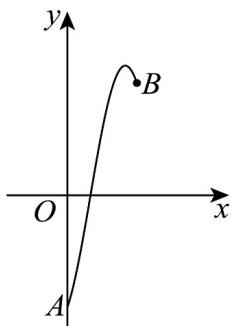
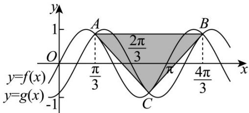

<!-- source-part:1 pages:1-50 -->

## 第五章 三角函数

内容概览

教学目标、教学重难点

<table><tr><td>教学目标</td><td>1.掌握任意角的概念,并能用集合的形式表示任意角;2.掌握弧度制与角度制的互化3.掌握与弧度制相关的弧长公式和面积公式的运用;4.会用同角三角函数的基本关系进行求值、化简、证明5.会作正弦函数、余弦函数的图象的同时,能认识图象与三角函数的密切关系,并能解决与图象有关的三角函数问题6.会求正、余弦函数及正切函数的最小正周期,单调区间,对称点,对称区间,会求两类函数的最值.7.会运用三角函数的相关公式进行简单的三角恒等变换,并能解决与三角函数有关的计算、化简、证明等问题.8.会画函数的图象,会结合图象解决与函数有关的性质问题,会求函数的解析式,掌握函数图象的变换规律.</td></tr><tr><td>教学重难点</td><td>1、重点理解与掌握诱导公式的内容,会用诱导公式进行相关的运算2、难点会利用两角和与差的正弦、余弦、正切公式进行三角函数式的求值、化简及证明;掌握二倍角公式的恒等变形与应用,解决与二倍角有关的三角函数式的计算与证明</td></tr></table>

## 知识清单

## 知识点 01 三角函数基本概念

## 1、角的概念

(1) 任意角：①定义：角可以看成平面内一条射线绕着端点从一个位置旋转到另一个位置所成的图形；

②分类：角按旋转方向分为正角、负角和零角。

(2) 所有与角 $\alpha$ 终边相同的角，连同角 $\alpha$ 在内，构成的角的集合是 $S = \left\{\beta \mid \beta = k \cdot 360^{\circ} + \alpha, k \in Z\right\}$

（3）象限角：使角的顶点与原点重合，角的始边与 $x$ 轴的非负半轴重合，那么，角的终边在第几象限，就说这个角是第几象限角；如果角的终边在坐标轴上，就认为这个角不属于任何一个象限。

(4) 象限角的集合表示方法：

第一象限角: $\{\alpha|2k\pi<\alpha<2k\pi+\frac{\pi}{2},k\in\mathbf{Z}\}$ 第二象限角: $\{\alpha|2k\pi+\frac{\pi}{2}<\alpha<2k\pi+\pi,k\in\mathbf{Z}\}$ 第三象限角: $\{\alpha|2k\pi+\pi<\alpha<2k\pi+\frac{3\pi}{2},k\in\mathbf{Z}\}$ 第四象限角: $\{\alpha|2k\pi+\frac{3\pi}{2}<\alpha<2k\pi+2\pi,k\in\mathbf{Z}\}$

## 2、弧度制

（1）定义：把长度等于半径长的弧所对的圆心角叫做1弧度的角，用符号rad表示，读作弧度．正角的弧度数是一个正数，负角的弧度数是一个负数，零角的弧度数是0．

(2) 角度制和弧度制的互化： $180^{\circ}=\pi rad$ ， $1^{\circ}=\frac{\pi}{180}rad$ ， $1rad=\frac{180^{\circ}}{\pi}$

(3) 扇形的弧长公式： $l=\left|\alpha\right|\cdot r$ ，扇形的面积公式： $S=\frac{1}{2}lr=\frac{1}{2}\left|\alpha\right|\cdot r^{2}$

## 3、任意角的三角函数

(1) 定义：任意角 $\alpha$ 的终边与单位圆交于点 $P(x, y)$ 时，则 $\sin \alpha = y, \cos \alpha = x, \tan \alpha = \frac{y}{x} (x \neq 0)$

(2) 推广：三角函数坐标法定义中，若取点 $P^{P(x, y)}$ 是角 $\alpha$ 终边上异于顶点的任一点，设点 $P$ 到原点 $O$

的距离为 $r$ ，则 $\sin \alpha = \frac{y}{r}$ ， $\cos \alpha = \frac{x}{r}$ ， $\tan \alpha = \frac{y}{x} (x\neq 0)$

三角函数的性质如下表：

<table><tr><td>三角函数</td><td>定义域</td><td>第一象限符号</td><td>第二象限符号</td><td>第三象限符号</td><td>第四象限符号</td></tr><tr><td>sin α</td><td>R</td><td>+</td><td>+</td><td>-</td><td>-</td></tr><tr><td>cos α</td><td>R</td><td>+</td><td>-</td><td>-</td><td>+</td></tr><tr><td>tan α</td><td>{α|α≠kπ+π/2, k∈Z}</td><td>+</td><td>-</td><td>+</td><td>-</td></tr></table>

记忆口诀：三角函数值在各象限的符号规律：一全正、二正弦、三正切、四余弦。

## 【即学即练】

1. 若角 $\alpha = k \cdot 180^{\circ} - 2025^{\circ}$ ， $k \in \mathbf{Z}$ ，则符合条件的角 $\alpha$ 的最大负角为（）A. $-30^{\circ}$ B. $-45^{\circ}$ C. $-225^{\circ}$ D. $-405^{\circ}$

【答案】B

【详解】由 $k\cdot180^{\circ}-2025^{\circ}<0$ ，得k<11.25.

又 $k \in \mathbf{Z}$ ，所以角 $\alpha$ 符合条件的最大负角为 $\alpha = 11 \times 180^{\circ} - 2025^{\circ} = -45^{\circ}$ 。

故选：B.

2．若函数 $f(x)$ 是定义在 R 上的奇函数，且满足 $f(x+\pi)=f(x)$ ，当 $x\in\left(0,\frac{\pi}{2}\right)$ 时， $f(x)=3\cos x$ ，则 $f\left(-\frac{13\pi}{3}\right)+f\left(\frac{9\pi}{4}\right)+f(2\pi)=$ A. $\frac{3\sqrt{2}+1}{2}$ B. 1 C. $\frac{3\sqrt{2}-3}{2}$ D. 0

【答案】C

【详解】 $f(x)$ 是定义在R上的奇函数，则 $f(x) = -f(-x)$

又满足 $f(x+\pi)=f(x)$ ，可得 $f(x)$ 的最小正周期为 $\pi$ ，

所以 $f(x + \pi) = -f(-x)$ ，则 $f(x)$ 的图象关于点 $\left(\frac{\pi}{2}, 0\right)$ 对称，即 $f\left(\frac{\pi}{2}\right) = 0$

又当 $x \in \left(0, \frac{\pi}{2}\right)$ 时， $f(x) = 3\cos x$

所以 $f\left(-\frac{13\pi}{3}\right) + f\left(\frac{9\pi}{4}\right) + f(2\pi) = f\left(-4\pi - \frac{\pi}{3}\right) + f(2\pi + \frac{\pi}{4}) + f(0)$

$$
= f \left(- \frac {\pi}{3}\right) + f \left(\frac {\pi}{4}\right) + f (0) = - f \left(\frac {\pi}{3}\right) + f \left(\frac {\pi}{4}\right) + f (0)
$$

$$
= - 3 \cos \frac {\pi}{3} + 3 \cos \frac {\pi}{4} + 0 = \frac {3 \sqrt {2} - 3}{2}.
$$

故选：C.

## 知识点 02 同角三角函数基本关系

(1) 倒数关系： $\sin \alpha \cdot \csc \alpha = 1$ $\cos \alpha \cdot \sec \alpha = 1$ $\tan \alpha \cdot \cot \alpha = 1$

$$
\tan \alpha = \frac {\sin \alpha}{\cos \alpha} (\cos \alpha \neq 0) \cot \alpha = \frac {\cos \alpha}{\sin \alpha} (\sin \alpha \neq 0)
$$

(2) 商数关系：

(3) 平方关系： $\sin^2\alpha + \cos^2\alpha = 1; 1 + \tan^2\alpha = \sec^2\alpha; 1 + \cot^2\alpha = \csc^2\alpha.$

$$
\begin{array}{l l} & {\frac {\sin \frac {\alpha}{2}}{\cos \frac {\alpha}{2}} = \tan \frac {\alpha}{2}} \\ {\sin^ {2} 3 \alpha + \cos^ {2} 3 \alpha = 1} & \end{array}
$$

注意：1）“同角”的概念与角的表达形式无关，如：

2）上述关系（公式）都必须在定义域允许的范围内成立。

3）由一个角的任一三角函数值可求出这个角的其余各三角函数值，且因为利用“平方关系”公式，最终需求平方根，会出现两解，因此应尽可能少用,若使用时,要注意讨论符号。

【即学即练】

1. 如果角 $\alpha$ 的终边在直线 $y = 2x$ 上，则 $5\sin^2\alpha + 3\sin\alpha\cos\alpha - 2 = (\quad)$ A. $-\frac{4}{5}$ B. $\frac{16}{5}$ C. $-\frac{16}{5}$ D. $\frac{16}{5}$ 或 $-\frac{4}{5}$

【答案】B

【详解】方法一：

因为角 $\alpha$ 的终边在直线 $y = 2x$ 上，所以设直线 $y = 2x$ 上一点 $(m,2m)(m\neq 0)$ 可得 $\tan \alpha = \frac{2m}{m} = 2$ 所以 $5\sin^2\alpha +3\sin \alpha \cos \alpha -2 = 5\sin^2\alpha +3\sin \alpha \cos \alpha -2(\sin^2\alpha +\cos^2\alpha)$ $= 3\sin \alpha \cos \alpha +3\sin^2\alpha -2\cos^2\alpha = \frac{3\sin\alpha\cos\alpha + 3\sin^2\alpha - 2\cos^2\alpha}{\sin^2\alpha + \cos^2\alpha}$ $= \frac{3\tan\alpha + 3\tan^{2}\alpha - 2}{\tan^{2}\alpha + 1} = \frac{3\times 2 + 3\times 2^{2} - 2}{2^{2} + 1} = \frac{16}{5}$

方法二：

直线 $y = 2x$ 过第一象限和第三象限.

若 $\alpha$ 的终边在第一象限，可取终边上一点 $(1,2)$ ，

则 $\sin \alpha = \frac{2}{\sqrt{1^2 + 2^2}} = \frac{2\sqrt{5}}{5},\cos \alpha = \frac{1}{\sqrt{1^2 + 2^2}} = \frac{\sqrt{5}}{5}$

则 $5\sin^2\alpha + 3\sin \alpha \cos \alpha - 2 = 5 \times \frac{4}{5} + 3 \times \frac{2\sqrt{5}}{5} \times \frac{\sqrt{5}}{5} - 2 = \frac{16}{5}$

若 $\alpha$ 的终边在第三象限，可取终边上一点 $(-1,-2)$ ，

则 $\sin \alpha = \frac{-2}{\sqrt{(-1)^2 + (-2)^2}} = -\frac{2\sqrt{5}}{5}$ ， $\cos \alpha = \frac{-1}{\sqrt{(-1)^2 + (-2)^2}} = -\frac{\sqrt{5}}{5}$

$$
5 \sin^ {2} \alpha + 3 \sin \alpha \cos \alpha - 2 = 5 \times \frac {4}{5} + 3 \times \left(- \frac {2 \sqrt {5}}{5}\right) \times \left(- \frac {\sqrt {5}}{5}\right) - 2 = \frac {1 6}{5}
$$

故选：B

2. 已知 $\sin\alpha + \cos\alpha = \frac{2}{3}$ ，且 $\alpha \in (0, \pi)$ ，则 $\frac{\sin\alpha - \cos\alpha}{\sin\alpha \cdot \cos\alpha} = (\quad)$ A. $-\frac{3\sqrt{14}}{5}$ B. $\frac{3\sqrt{14}}{5}$ C. $-\frac{6\sqrt{14}}{5}$ D. $\frac{6\sqrt{14}}{5}$

【答案】C

【详解】因为 $\alpha \in (0,\pi)$ ，所以 $\sin \alpha >0$

因为 $\sin \alpha +\cos \alpha = \frac{2}{3}$ 又 $\sin^2\alpha +\cos^2\alpha = 1$

所以 $\sin^2\alpha +\cos^2\alpha +2\sin \alpha \cos \alpha = \frac{4}{9},\sin \alpha \cos \alpha = -\frac{5}{18}$ ，所以 $\sin \alpha >0,\cos \alpha < 0$

所以 $(\sin \alpha -\cos \alpha)^2 = 1 - 2\sin \alpha \cos \alpha = 1 + \frac{5}{9} = \frac{14}{9}$

又 $\sin \alpha -\cos \alpha >0$ ，所以 $\sin \alpha -\cos \alpha = \frac{\sqrt{14}}{3}$

所以 $\frac{\sin\alpha-\cos\alpha}{\sin\alpha\cdot\cos\alpha}=\frac{\frac{\sqrt{14}}{3}}{-\frac{5}{18}}=-\frac{6\sqrt{14}}{5}$ .

故选：C.

## 知识点 03 三角函数诱导公式

<table><tr><td>公式</td><td>一</td><td>二</td><td>三</td><td>四</td><td>五</td><td>六</td></tr><tr><td>角</td><td> $2k\pi + \alpha (k \in Z)$ </td><td> $\pi + \alpha$ </td><td> $-\alpha$ </td><td> $\pi - \alpha$ </td><td> $\frac{\pi}{2} - \alpha$ </td><td> $\frac{\pi}{2} + \alpha$ </td></tr><tr><td>正弦</td><td> $\sin \alpha$ </td><td> $-\sin \alpha$ </td><td> $-\sin \alpha$ </td><td> $\sin \alpha$ </td><td> $\cos \alpha$ </td><td> $\cos \alpha$ </td></tr><tr><td>余弦</td><td> $\cos \alpha$ </td><td> $-\cos \alpha$ </td><td> $\cos \alpha$ </td><td> $-\cos \alpha$ </td><td> $\sin \alpha$ </td><td> $-\sin \alpha$ </td></tr><tr><td>正切</td><td> $\tan \alpha$ </td><td> $\tan \alpha$ </td><td> $-\tan \alpha$ </td><td> $-\tan \alpha$ </td><td></td><td></td></tr><tr><td>口诀</td><td colspan="4">函数名不变,符号看象限</td><td colspan="2">函数名改变,符号看象限</td></tr></table>

【记忆口诀】奇变偶不变，符号看象限，说明：（1）先将诱导三角函数式中的角统一写作 $n \cdot \frac{\pi}{2} \pm \alpha$ ；（2）

无论有多大，一律视为锐角，判断 $n \cdot \frac{\pi}{2} \pm \alpha$ 所处的象限，并判断题设三角函数在该象限的正负；（3）当 $n$ 为

奇数是，“奇变”，正变余，余变正；当 $n$ 为偶数时，“偶不变”函数名保持不变即可。

【即学即练】

1. 已知 $\cos\left(\alpha+\frac{\pi}{3}\right)=-\frac{5}{13},\alpha\in\left(0,\frac{\pi}{2}\right)$ ，则 $\cos\left(\frac{\pi}{6}-\alpha\right)$ 的值为（） A. $-\frac{12}{13}$ B. $-\frac{5}{13}$ C. $\frac{5}{13}$ D. $\frac{12}{13}$

【答案】D

【详解】因为 $\alpha\in\left(0,\frac{\pi}{2}\right)$ ，所以 $\alpha+\frac{\pi}{3}\in\left(\frac{\pi}{3},\frac{5\pi}{6}\right)$ ，则由 $\cos\left(\alpha+\frac{\pi}{3}\right)=-\frac{5}{13}$ ，
可得 $\sin\left(\alpha+\frac{\pi}{3}\right)=\sqrt{1-\left(-\frac{5}{13}\right)^{2}}=\frac{12}{13}$

故 $\cos \left(\frac{\pi}{6} -\alpha\right) = \cos \left[\frac{\pi}{2} -\left(\alpha +\frac{\pi}{3}\right)\right] = \sin \left(\alpha +\frac{\pi}{3}\right) = \frac{12}{13}$

故选：D

2. $\tan \left(-\frac{2\pi}{3}\right) =$ （ ） A. $-\frac{\sqrt{3}}{3}$ B. $\frac{\sqrt{3}}{3}$ C. $-\sqrt{3}$ D. $\sqrt{3}$

【答案】D

【详解】 $\tan \left(-\frac{2\pi}{3}\right) = \frac{\sin\left(-\frac{2\pi}{3}\right)}{\cos\left(-\frac{2\pi}{3}\right)} = \frac{-\sin\frac{2\pi}{3}}{\cos\frac{2\pi}{3}} = \frac{-\frac{\sqrt{3}}{2}}{-\frac{1}{2}} = \sqrt{3}$

故选：D.

## 知识点 04 三角函数的图像与性质

## 正弦函数、余弦函数、正切函数的图象和性质

<table><tr><td>函数</td><td> $y = \sin x$ </td><td> $y = \cos x$ </td><td> $y = \tan x$ </td></tr><tr><td>图像</td><td></td><td></td><td></td></tr><tr><td>定义域</td><td colspan="2">R</td><td> $\left\{ x \mid x \neq k\pi + \frac{\pi}{2}, k \in Z \right\}$ </td></tr><tr><td>值域</td><td colspan="2">[-1,1]</td><td>R</td></tr><tr><td>有界性</td><td> $|\sin x| \le 1$ </td><td> $|\cos x| \le 1$ </td><td>无</td></tr><tr><td>最小正周期</td><td colspan="2">2π</td><td>π</td></tr><tr><td>单调性</td><td>增区间: $\left[2k\pi - \frac{\pi}{2}, 2k\pi + \frac{\pi}{2}\right]_{k \in Z}$ 减区间: $\left[2k\pi + \frac{\pi}{2}, 2k\pi + \frac{3\pi}{2}\right]_{k \in Z}$ </td><td>增区间: $\left[2k\pi - \pi, 2k\pi\right]_{k \in Z}$ 减区间: $\left[2k\pi - \pi, 2k\pi\right]_{k \in Z}$ </td><td>增区间: $\left(k\pi - \frac{\pi}{2}, k\pi + \frac{\pi}{2}\right)_{k \in Z}$ </td></tr><tr><td>奇偶性</td><td>奇</td><td>偶</td><td>奇</td></tr><tr><td>最值</td><td> $x = 2k\pi + \frac{\pi}{2}$ 时, $y_{\max } = 1$  $x = 2k\pi - \frac{\pi}{2}$ 时, $y_{\min } = -1$  $k \in Z$ </td><td> $x = 2k\pi$ 时, $y_{\max } = 1$  $x = 2k\pi + \pi$ 时, $y_{\min } = -1$  $k \in Z$ </td><td>无</td></tr><tr><td>对称轴</td><td> $x = k\pi + \frac{\pi}{2}, k \in Z$ </td><td> $x = k\pi, k \in Z$ </td><td>无</td></tr><tr><td>对称中心</td><td> $(k\pi,0), k \in Z$ </td><td> $\left(k\pi + \frac{\pi}{2}, 0\right), k \in Z$ </td><td> $\left(\frac{k\pi}{2}, 0\right), k \in Z$ </td></tr></table>

## 【即学即练】

1. 关于函数 $f(x) = \sin x$ 的图象与性质的描述正确的是（ ）A．最小正周期是 $2\pi$ B．图象的对称轴为 $x = \frac{k\pi}{2} (k \in \mathbb{Z})$

C．单调增区间是 $\left[-\frac{\pi}{2}+2k\pi,\frac{\pi}{2}+2k\pi\right]$ D．图象的对称中心为 $(2k\pi,0)(k\in\mathbb{Z})$

【答案】A

【详解】 $f(x)=\sin x$ 的最小正周期是 $2\pi$ ，故 A 正确；

对称轴为 $x=\frac{\pi}{2}+k\pi(k\in\mathbb{Z})$ ，故 B 错误；

单调增区间是 $\left[-\frac{\pi}{2} + 2k\pi, \frac{\pi}{2} + 2k\pi\right](k \in \mathbb{Z})$ ，原结论缺少 $k \in \mathbb{Z}$ ，故 $^C$ 错误；

图象的对称中心为 $(k\pi,0)(k\in Z)$ ，故D错误；

故选：A.

2. 已知函数 $f(x) = \cos (\sin x) - \sin (\cos x)$ ，则（）

【答案】

A． $f(x)$ 为偶函数，且在 $\left[\frac{\pi}{2},\pi\right]$ 上单调递增 B． $f(x)$ 为偶函数，且在 $\left[\frac{\pi}{2},\pi\right]$ 上单调递减

C． $f(x)$ 为奇函数，且在 $\left[\frac{\pi}{2},\pi\right]$ 上单调递增 D． $f(x)$ 为奇函数，且在 $\left[\frac{\pi}{2},\pi\right]$ 上单调递减

【答案】A

【详解】因为 $f(x) = \cos (\sin x) - \sin (\cos x)$ ，所以 $f(x)$ 的定义域为 $\mathbf{R}$ ，

易知 $f(-x)=\cos[\sin(-x)]-\sin[\cos(-x)]=\cos(-\sin x)-\sin(\cos x)=\cos(\sin x)-\sin(\cos x)=f(x)$ ，所以 $f(x)$ 为偶

函数.

设 $x_{1}, x_{2} \in \left[\frac{\pi}{2}, \pi\right]$ ，且 $x_{1} < x_{2}$ ，则 $1 \sin x_{1} > \sin x_{2} 0, 0 \cos x_{1} > \cos x_{2} - 1$ ，

所以 $\cos\left(\sin x_{1}\right)<\cos\left(\sin x_{2}\right)$ ， $\sin\left(\cos x_{1}\right)>\sin\left(\cos x_{2}\right)$ ， $-\sin\left(\cos x_{1}\right)<-\sin\left(\cos x_{2}\right)$

于是 $\cos (\sin x_1) - \sin (\cos x_1) <   \cos (\sin x_2) - \sin (\cos x_2)$ ，即 $f(x_{1}) <   f(x_{2})$

所以在 $\left[\frac{\pi}{2},\pi\right]$ 上单调递增.

故选：A

## 知识点 05 两角和差公式以及辅助角公式

(1) 两角差的余弦、正弦和正切

$$
\cos (\alpha - \beta) = \cos \alpha \cos \beta + \sin \alpha \sin \beta
$$

$$
\sin (\alpha - \beta) = \sin \alpha \cos \beta - \cos \alpha \sin \beta
$$

$$
\tan (\alpha - \beta) = \frac {\tan \alpha - \tan \beta}{1 + \tan \alpha \tan \beta}
$$

(2) 两角和的余弦、正弦和正切

$$
\cos (\alpha + \beta) = \cos \alpha \cos \beta - \sin \alpha \sin \beta
$$

$$
\sin (\alpha + \beta) = \sin \alpha \cos \beta + \cos \alpha \sin \beta
$$

$$
\tan (\alpha + \beta) = \frac {\tan \alpha + \tan \beta}{1 - \tan \alpha \tan \beta}
$$

$f(x) = a\sin \omega x + b\cos \omega x = \sqrt{a^2 + b^2}\sin (\omega x + \theta)$ (其中 $\theta$ 角所在的象限由 $a,b$ 的符号确定， $\theta$ 角的值由 $\tan \theta = \frac{b}{a}$ 确定)在求最值、化简时起着重要作用。

【即学即练】

1. 已知 $\alpha$ ， $\beta$ 为锐角， $\tan (\alpha + \beta) = -1$ ， $2\tan \alpha = 3\tan \beta$ ，则 $\cos (\alpha - \beta)$ 的值为（）A. $\frac{7\sqrt{2}}{10}$ B. $-\frac{7\sqrt{2}}{10}$ C. $\frac{5\sqrt{2}}{14}$ D. $-\frac{5\sqrt{2}}{14}$

【答案】A

【详解】因为 $\alpha$ ， $\beta$ 为锐角， $\tan (\alpha + \beta) = -1$

所以 $\alpha + \beta = \frac{3\pi}{4}$ ，设 $\tan \beta = t$ ，

因为 $2\tan\alpha = 3\tan\beta$ ，所以 $\tan\alpha = \frac{3}{2}t$ ，

因为 $\tan (\alpha +\beta) = \frac{\tan\alpha + \tan\beta}{1 - \tan\alpha\tan\beta} = -1$

所以 $\frac{\frac{3}{2}t + t}{1 - \frac{3}{2}t^2} = -1$ ，所以或 $-\frac{1}{3}$

因为 $\beta$ 为锐角，所以 $\tan \beta = 2$

所以 $\tan \alpha = 3$ ，根据同角关系式可得 $\sin \alpha = \frac{3}{\sqrt{10}}$ ， $\cos \alpha = \frac{1}{\sqrt{10}}$ ， $\sin \beta = \frac{2}{\sqrt{5}}$ ， $\cos \beta = \frac{1}{\sqrt{5}}$ ， $\cos (\alpha -\beta) = \cos \alpha \cos \beta +\sin \alpha \sin \beta = \frac{7\sqrt{2}}{10}.$

故选：A.

2. $\frac{\sqrt{3}}{2}\tan 23^{\circ} - \frac{\cos 37^{\circ}}{\sin 67^{\circ}} =$ ( A . $-\frac{\sqrt{3}}{2}$ B . $-\frac{1}{2}$ C . $\frac{1}{2}$ D . $\frac{\sqrt{3}}{2}$

【答案】B

【详解】 $\frac{\sqrt{3}}{2}\tan 23^{\circ} - \frac{\cos 37^{\circ}}{\sin 67^{\circ}}$ $= \frac{\sqrt{3}\sin 23^{\circ}}{2\cos 23^{\circ}} -\frac{\cos 37^{\circ}}{\cos 23^{\circ}} = \frac{\sqrt{3}\sin 23^{\circ} - 2\cos 37^{\circ}}{2\cos 23^{\circ}}$ $= \frac{\sqrt{3}\sin 23^{\circ} - 2\cos(60^{\circ} - 23^{\circ})}{2\cos 23^{\circ}} = \frac{\sqrt{3}\sin 23^{\circ} - 2\cos 60^{\circ}\cos 23^{\circ} - 2\sin 60^{\circ}\sin 23^{\circ}}{2\cos 23^{\circ}}$ $= \frac{\sqrt{3}\sin 23^{\circ} - \cos 23^{\circ} - \sqrt{3}\sin 23^{\circ}}{2\cos 23^{\circ}} = -\frac{1}{2}$

故选：B.

(1) 二倍角公式： $\sin2\alpha=2\sin\alpha\cos\alpha;\cos2\alpha=\cos^{2}\alpha-\sin^{2}\alpha;\tan2\alpha=\frac{2\tan\alpha}{1-\tan^{2}\alpha}$

(2) 升幂公式： $\cos 2\alpha = 2\cos^2\alpha - 1$ $\cos 2\alpha = 1 - 2\sin^2\alpha$

$$
\cos^ {2} \alpha = \frac {1 + \cos 2 \alpha}{2} \quad \sin^ {2} \alpha = \frac {1 - \cos 2 \alpha}{2}
$$

(3) 降幂公式：

$$
\sin \frac {\alpha}{2} = \pm \sqrt {\frac {1 - \cos \alpha}{2}}, \quad \cos \frac {\alpha}{2} = \pm \sqrt {\frac {1 + \cos \alpha}{2}} \quad , \quad \tan \frac {\alpha}{2} = \pm \sqrt {\frac {1 - \cos \alpha}{1 + \cos \alpha}} = \frac {\sin \alpha}{1 + \cos \alpha} = \frac {1 - \cos \alpha}{\sin \alpha}
$$

(4) 半角公式：

$$
\tan \frac {a}{2} = \frac {\sin \frac {a}{2}}{\cos \frac {a}{2}} = \frac {\sin \frac {a}{2} \cos \frac {a}{2}}{\cos^ {2} \frac {a}{2}} = \frac {\sin a}{1 + \cos a}
$$

$$
\tan \frac {a}{2} = \frac {\sin \frac {a}{2}}{\cos \frac {a}{2}} = \frac {\sin^ {2} \frac {a}{2}}{\sin \frac {a}{2} \cos \frac {a}{2}} = \frac {1 - \cos a}{\sin a}
$$

(5) 万能公式：

$$
\sin \alpha = \frac {2 \tan \frac {\alpha}{2}}{1 + \tan^ {2} \frac {\alpha}{2}}, \cos \alpha = \frac {1 - \tan^ {2} \frac {\alpha}{2}}{1 + \tan^ {2} \frac {\alpha}{2}}, \tan \alpha = \frac {2 \tan \frac {\alpha}{2}}{1 - \tan^ {2} \frac {\alpha}{2}}.
$$

重点：同角三角函数关系式的常用变形

(1) 弦切互化法：主要利用公式

化成正、余弦．

(2) 和积转换法：利用 $(\sin \theta \pm \cos \theta)^{2} = 1 \pm 2 \sin \theta \cos \theta$ 的关系进行变形、转化.

(3) 巧用“1”的变换： $1 = \sin^{2}\theta + \cos^{2}\theta = \cos^{2}\theta (1 + \tan^{2}\theta) = \tan45^{\circ} = \ldots$

(4) 齐次式转化

①一次分式齐次

$\frac{a\sin x + b\cos x}{c\sin x + d\cos x}$ 同除 $\cos x$ 进行弦化切

②二次整式齐次

$a\sin^{2}x + b\sin x\cos x + c\cos^{2}x$ 除以1 $\left(\sin^{2}\alpha + \cos^{2}\alpha = 1\right)$ ，再除 $\cos^{2}x$ 进行弦化切

## 【即学即练】

1. 已知 $\cos^{2}\left(\frac{\pi}{4}+\alpha\right)=\frac{3}{5}$ ，则 $\sin2\alpha=(\quad)$ A. $\frac{3}{5}$ B. $-\frac{3}{5}$ C. $\frac{1}{5}$ D. $-\frac{1}{5}$

【答案】D

【详解】 $\cos^2\left(\frac{\pi}{4} +\alpha\right) = \frac{1 + \cos(\frac{\pi}{2} + 2\alpha)}{2} = \frac{1 - \sin 2\alpha}{2} = \frac{3}{5}$ ，解得： $\sin 2\alpha = -\frac{1}{5}$

故选：D

2. 已知函数 $f(x) = \sin x - \sqrt{3} \cos x, f(x_0) = -\frac{1}{2}, x_0 \in (0, \pi)$ ，则 $\sin x_0$ 的值为（）A. $\frac{3\sqrt{5} - 1}{8}$ B. $\frac{\sqrt{15} - 1}{8}$ C. $\frac{\sqrt{15} + 1}{8}$ D. $\frac{3\sqrt{5} + 1}{8}$

【答案】A

【详解】函数 $f(x) = \sin x - \sqrt{3}\cos x = 2\sin (x - \frac{\pi}{3})$ ，由 $f(x_0) = -\frac{1}{2}$ ，得 $\sin (x_0 - \frac{\pi}{3}) = -\frac{1}{4} < 0$ 由 $x_0\in (0,\pi)$ ，得 $x_0 - \frac{\pi}{3}\in (-\frac{\pi}{3},\frac{2\pi}{3})$ ，则 $x_0 - \frac{\pi}{3}\in (-\frac{\pi}{3},0)$ ， $\cos (x_0 - \frac{\pi}{3}) = \frac{\sqrt{15}}{4}$ 所以 $\sin x_0 = \sin [(x_0 - \frac{\pi}{3}) + \frac{\pi}{3}] = \sin (x_0 - \frac{\pi}{3})\cos \frac{\pi}{3} +\cos (x_0 - \frac{\pi}{3})\sin \frac{\pi}{3}$ $= -\frac{1}{4}\times \frac{1}{2} +\frac{\sqrt{15}}{4}\times \frac{\sqrt{3}}{2} = \frac{3\sqrt{5} - 1}{8}.$

故选：A

## 知识点 07 三角函数的变换

(1) $y = A\sin (\omega x + \varphi) + B$ （其中 $A > 0, \omega > 0$ ）最大值是 $A + B$ ，最小值是 $-A + B$ ；振幅是 $A$ ，周期是 $T = \frac{2\pi}{\omega}$ ，频率是 $f = \frac{\omega}{2\pi}$ ，相位是 $\omega x + \varphi$ ，初相是 $\varphi$ ；其图像的对称轴是直线 $\omega x + \varphi = k\pi + \frac{\pi}{2} (k \in Z)$ 凡是该图像与直线 $y = B$ 的交点都是该图像的对称中心；

注意：对称轴都经过函数的最值点

(2) 由 $y = A \sin (\omega x + \varphi)$ 的图像求其函数式：

① 图中标有最大值、最小值的；由最值得A值，由周期得w值，带入曲线一点得 $\varphi$

② 图中未标有最大值、最小值的；由周期得 w 值，带入曲线一个零点坐标 $\left(-\frac{\varphi}{\omega},0\right)$ 得 $\varphi$ ；带入曲线一非零点得 A

(3) 函数 $y = A \sin (\omega x + \varphi) + B$ 的图像与函数 $y = \sin x$ 的图像之间可以通过变化 $A, \omega, \varphi, B$ 来相互转化； $A, \omega$ 影响图像的形状， $\varphi, B$ 影响图像与 $x$ 轴交点的位置；由 $A$ 引起的变换称振幅变换，由 $\omega$ 引起的变换称周期变换，它们都是伸缩变换；由 $\varphi$ 引起的变换称相位变换，由 $B$ 引起的变换称上下平移变换，它们都是平移变换；

既可以将三角函数的图像先平移后伸缩也可以将其先伸缩后平移；

变换方法如下：

先平移后伸缩：

先伸缩后平移：

## 【即学即练】

1. 如图是函数 $y = A\sin (\omega x + \varphi)(A > 0, \omega > 0, x \in \mathbf{R})$ 在区间 $\left[-\frac{\pi}{6}, \frac{5\pi}{6}\right]$ 上的图象。为了得到这个函数的图象，只

要将 $y = \sin x (x \in \mathbf{R})$ 的图象上所有的点（）

A. 向左平移 $\frac{\pi}{3}$ 个单位长度，再把所得各点的横坐标缩短到原来的 $\frac{1}{2}$ 倍，纵坐标不变
B. 向左平移 $\frac{\pi}{3}$ 个单位长度，再把所得各点的横坐标伸长到原来的 $^2$ 倍，纵坐标不变
C. 向左平移 $\frac{\pi}{6}$ 个单位长度，再把所得各点的横坐标缩短到原来的 $\frac{1}{2}$ 倍，纵坐标不变
D. 向左平移 $\frac{\pi}{6}$ 个单位长度，再把所得各点的横坐标伸长到原来的 $^2$ 倍，纵坐标不变

【答案】A

【详解】由题图象知 $A = 1, T = \frac{5\pi}{6} - \left(-\frac{\pi}{6}\right) = \pi$

所以 $\omega = \frac{2\pi}{T} = 2$ 。所以 $f(x) = \sin (2x + \varphi)$ ，又图象过点 $\left(\frac{\pi}{3}, 0\right)$ ，由五点法知 $\frac{2\pi}{3} + \varphi = \pi$ ，所以 $\varphi = \frac{\pi}{3}$

所以 $y = \sin\left(2x + \frac{\pi}{3}\right)$

故将函数 $y = \sin x$ 的图象先向左平移 $\frac{\pi}{3}$ 个单位后，再把所得图象上各点的横坐标缩短为原来的 $\frac{1}{2}$ （纵坐标不
度），可得函数 $y = \sin \left(2x + \frac{\pi}{3}\right)$ 的图象．

故答案为：A.

2. 要得到函数 $f(x) = \sin \left(4x - \frac{\pi}{6}\right)$ 的图象，只需将函数 $g(x) = \sin x\cos x - \sqrt{3}\cos^2 x + \frac{\sqrt{3}}{2}$ 的图象作如下变换（）

【答案】

A. 先将 $g(x)$ 的图象向左平移 $\frac{\pi}{6}$ 单位，再将所得到的图象上的每点纵坐标不变而横坐标缩短到原来的 $\frac{1}{2}$

倍而得 $f(x)$ 的图象

B．先将 $g(x)$ 的图象向左平移 $\frac{\pi}{12}$ 单位，再将所得到的图象上的每点纵坐标不变而横坐标缩短到原来的 $\frac{1}{2}$

倍而得 $f(x)$ 的图象

C．先将 $g(x)$ 的图象上的每点纵坐标不变而横坐标缩短到原来的 $\frac{1}{2}$ 倍，再将所得的图象向左平移 $\frac{\pi}{6}$ 个单

位而得 $f(x)$ 的图象

D．先将 $g(x)$ 的图象上的每点纵坐标不变而横坐标缩短到原来的 $^{\frac{1}{2}}$ 倍，再将所得的图象向左平移 $^{\frac{\pi}{12}}$ 个单

位而得 $f(x)$ 的图象

【答案】B

【详解】 $g(x)=\sin x\cos x-\sqrt{3}\cos^{2}x+\frac{\sqrt{3}}{2}=\frac{1}{2}\sin 2x-\sqrt{3}\cdot\frac{1+\cos 2x}{2}+\frac{\sqrt{3}}{2}$

$$
= \frac {1}{2} \sin 2 x - \frac {\sqrt {3}}{2} \cos 2 x = \sin \left(2 x - \frac {\pi}{3}\right)
$$

由函数 $g(x)$ 的图象得到函数 $f(x)$ 的图象，

只需先将先将 $g(x)$ 的图象向左平移 $\frac{\pi}{12}$ 单位，得 $y = \sin \left(2x - \frac{\pi}{6}\right)$

再将所得到的图象上的每点纵坐标不变而横坐标缩短到原来的 $\frac{1}{2}$ 倍即可，故A错，B对；

或者先将 $g(x)$ 的图象上的每点纵坐标不变而横坐标缩短到原来的 $\frac{1}{2}$ 倍，

得 $y = \sin \left(4x - \frac{\pi}{3}\right)$

再将所得的图象向左平移 $\frac{\pi}{24}$ 个单位即可，故 CD 错误.

故选：B.

知识点 08 函数 $y = \sin(\omega x + \varphi)$ 的图像与性质

(1) 函数 $y = A \sin (\omega x + \varphi) (A > 0, \omega > 0)$ 的部分性质

<table><tr><td>函数</td><td> $y = A \sin(\omega x + \varphi) (A > 0, \omega > 0)$ </td></tr><tr><td>定义域</td><td> $\underline{\mathbf{R}}$ </td></tr><tr><td>值域</td><td> $[-A, A]$ </td></tr><tr><td>周期性</td><td> $T = \frac{2\pi}{\omega}$ </td></tr><tr><td>单调性</td><td> $[ \frac{4k\pi - \pi - 2\varphi}{2\omega}, \frac{4k\pi + \pi - 2\varphi}{2\omega}] (k \in Z)$ 单调递减区间 $\left\lbrack {\frac{{4k\pi } + \pi - {2\varphi }}{2\omega },\frac{{4k\pi } + {3\pi } - {2\varphi }}{2\omega }}\right\rbrack \left( {k \in Z}\right)$ </td></tr><tr><td>最值</td><td> $x = \frac{{4k\pi } + \pi - {2\varphi }}{2\omega },y_{\max } = A$  $x = \frac{{4k\pi } - \pi - {2\varphi }}{2\omega },y_{\min } = - A$ </td></tr></table>

(2) 奇偶性

①若 $y = A \sin(\omega x + \varphi)$ 为奇函数，则 $\phi = k\pi (k \in Z)$ ;

②若 $y = A \sin (\omega x + \varphi)$ 为偶函数，则 $\phi = k\pi + \frac{\pi}{2} (k \in Z)$

③若 $y = A\cos (\omega x + \varphi)$ 为奇函数，则 $\phi = k\pi +\frac{\pi}{2}\big(k\in Z\big)$

④若 $y = A \cos(\omega x + \varphi)$ 为偶函数，则 $\phi = k\pi (k \in Z)$ ;

(3) 对称性

①求函数 $y = A \sin (\omega x + \varphi) + b (\omega \neq 0)$ 的对称轴的方法

令 $\omega x + \varphi = \frac{\pi}{2} + k\pi (k \in Z)$ ，得 $x = \frac{\frac{\pi}{2} + k\pi - \varphi}{\omega} (k \in Z)$ ;

②求 $y = A\sin (\omega x + \varphi) + b(\omega \neq 0)$ 对称中心的方法

令 $\omega x + \varphi = k\pi (k\in Z)$ ，得 $x = \frac{k\pi - \varphi}{\omega}$ ，即对称中心为 $\left(\frac{k\pi - \varphi}{\omega}, b\right)$ .

③求函数 $y = A\cos (\omega x + \varphi) + b(\omega \neq 0)$ 的对称轴的方法：令 $\omega x + \varphi = k\pi (k\in Z)$ ，得 $x = \frac{k\pi - \varphi}{\omega} (k\in Z)$

④求函数 $y = A\cos (\omega x + \varphi) + b(\omega \neq 0)$ 的对称中心的方法

令 $\omega x + \varphi = k\pi + \frac{\pi}{2}(k \in Z)$ ，得 $x = \frac{\frac{\pi}{2} + k\pi - \varphi}{\omega}$ ，即对称中心 $y = A \cos \left( \frac{\frac{\pi}{2} + k\pi - \varphi}{\omega}, b \right) (k \in Z)$

(4) 对称轴、对称中心、最值与周期的关系

① $y = \sin (\omega x + \varphi)$ 相邻两条对称轴之间的距离为 $\frac{T}{2}$

$y = \sin (\omega x + \varphi)$ 任意两条对称轴之间的距离为半周期的整数倍，即 $\frac{kT}{2} (k\in \mathbb{N})$

② $y = \sin (\omega x + \varphi)$ 相邻两个对称中心之间的距离为 $\frac{T}{2}$ $y = \sin (\omega x + \varphi)$ 任意两个对称中心之间的距离为半周期的整数倍，即 $\frac{kT}{2} (k \in \mathbb{N})$ ③ $y = \sin (\omega x + \varphi)$ 相邻两条（个）对称轴与对称中心之间的距离为 $\frac{T}{4}$ $y = \sin (\omega x + \varphi)$ 任意对称轴与对称中心之间的距离为四分之一周期的奇数倍，

即 $\frac{(2k+1)T}{4} (k \in \mathbb{N})$ ④ $y = \sin (\omega x + \varphi)$ 相邻两个最大值（最小值）之间在 $x$ 轴上的距离为 $T$ ⑤ $y = \sin (\omega x + \varphi)$ 相邻两个最值之间在 $x$ 轴上的距离为 $\frac{T}{2}$ $y = \sin (\omega x + \varphi)$ 任意两个最值之间在 $x$ 轴上的距离为半周期的奇数倍，

即 $\frac{(2k+1)T}{2} (k \in \mathbb{N})$

## 【即学即练】

1．已知函数 $f(x)=M\sin(\omega x+\varphi)(M>0,\omega>0,-\pi<\varphi<0)$ 的部分图象如图所示，其中 $A(0,-\sqrt{3})$ ， $B\left(\frac{\pi}{3},\sqrt{3}\right)$

若将 $f(x)$ 的图象向右平移 $\frac{\pi}{18}$ 个单位长度后关于 $y$ 轴对称，则 $M = (\quad)$

A. $2\sqrt{2}$ B.3 C.4 D.2

【答案】D

【详解】由图知，点A在 $f(x)$ 的增区间内，点B在 $f(x)$ 的减区间内，又 $A(0, -\sqrt{3})$ ， $B(\frac{\pi}{3}, \sqrt{3})$ ，设 $f(x)$ 的最小正周期为 $T$ ，则 $\frac{T}{2} = \frac{\pi}{3} - 0 = \frac{\pi}{3}$ ，解得 $T = \frac{2\pi}{3}$ ，所以 $\omega = \frac{2\pi}{T} = 3$ ，因为将 $f(x)$ 的图象向右平移 $\frac{\pi}{18}$ 个单位长度后关于y轴对称，又 $f\left(x - \frac{\pi}{18}\right) = M\sin\left(3x - \frac{\pi}{6} + \varphi\right)$ ，所以 $-\frac{\pi}{6} + \varphi = \frac{\pi}{2} + k\pi (k \in Z)$ ，则 $\varphi = \frac{2\pi}{3} + k\pi (k \in Z)$ ，又 $-\pi < \varphi < 0$ ，所以 $k = -1, \varphi = -\frac{\pi}{3}$ ，故 $f(x) = M\sin\left(3x - \frac{\pi}{3}\right)$ ，将 $A(0, -\sqrt{3})$ 代入可得 $M\sin\left(-\frac{\pi}{3}\right) = -\sqrt{3}$ ，所以M=2。

故选：D.

2. 将函数 $f(x) = \sin 2x$ 的图象向右平移 $\varphi \left(0 < \varphi < \frac{\pi}{2}\right)$ 个单位长度得到函数 $g(x)$ 的图象，以 $f(x), g(x)$ 图象相

邻的三个交点为顶点的三角形面积为 $\frac{\sqrt{3}\pi}{2}$ ，则函数 $g(x)$ 图象的一个对称中心是（ ）A. $(\pi,0)$ B. $\left(\frac{\pi}{2},0\right)$

C. $\left(\frac{\pi}{3},0\right)$ D. $\left(\frac{\pi}{6},0\right)$

【答案】D

【详解】如图，

不妨取 $y$ 轴右侧的连续三个交点，分别记为 $A, C, B, g(x) = \sin 2(x - \varphi)$ 的最小正周期为 $\pi$ ，可得 $AB = \pi$ ，由VABC的面积为 $\frac{\sqrt{3}\pi}{2}$ 及对称性知， $\frac{1}{2} \times 2y_A \cdot \pi = \frac{\sqrt{3}}{2}\pi$ ，解得 $y_A = \frac{\sqrt{3}}{2}$

进而 $A\left(\frac{\pi}{3},\frac{\sqrt{3}}{2}\right)$ ，代入 $g(x)=\sin2(x-\varphi)$ 得 $\frac{\sqrt{3}}{2}=\sin2\left(\frac{\pi}{3}-\varphi\right)$ ，

即 $\sin \left(\frac{2\pi}{3} - 2\varphi\right) = \frac{\sqrt{3}}{2}$ ，并结合 $0 < \varphi < \frac{\pi}{2}$ ，得 $\varphi = \frac{\pi}{6}$ ，

所以 $g(x)=\sin2\left(x-\frac{\pi}{6}\right)=\sin\left(2x-\frac{\pi}{3}\right)$ . 令 $2x-\frac{\pi}{3}=k\pi(k\in\mathbf{Z})$

解得 $x = \frac{\pi}{6} +\frac{k\pi}{2}\bigl (k\in \mathbf{Z}\bigr)$ ，所以函数 $g(x)$ 图象的对称中心是 $\left(\frac{\pi}{6} +\frac{k\pi}{2},0\right)\bigl (k\in \mathbf{Z}\bigr)$

所以 $\left(\frac{\pi}{6},0\right)$ 是函数 $g(x)$ 图象的一个对称中心.

故选：D.

题型精讲

![[高中/课堂同步/题库/人教A版高中数学同步讲义(2026)/01_必修第一册/第五章 三角函数/第五章 三角函数（高效培优讲义）数学人教A版2019高一必修第一册/题型01_三角函数的概念/题型01_三角函数的概念.md]]
![[高中/课堂同步/题库/人教A版高中数学同步讲义(2026)/01_必修第一册/第五章 三角函数/第五章 三角函数（高效培优讲义）数学人教A版2019高一必修第一册/题型02_扇形的弧长与面积_含最值/题型02_扇形的弧长与面积_含最值.md]]
![[高中/课堂同步/题库/人教A版高中数学同步讲义(2026)/01_必修第一册/第五章 三角函数/第五章 三角函数（高效培优讲义）数学人教A版2019高一必修第一册/题型03_同角三角函数基本关系/题型03_同角三角函数基本关系.md]]
![[高中/课堂同步/题库/人教A版高中数学同步讲义(2026)/01_必修第一册/第五章 三角函数/第五章 三角函数（高效培优讲义）数学人教A版2019高一必修第一册/题型04_正余弦齐次式的计算/题型04_正余弦齐次式的计算.md]]
![[高中/课堂同步/题库/人教A版高中数学同步讲义(2026)/01_必修第一册/第五章 三角函数/第五章 三角函数（高效培优讲义）数学人教A版2019高一必修第一册/题型05_sin_alpha_pm_cos_alpha_和_sin_al/题型05_sin_alpha_pm_cos_alpha_和_sin.md]]
![[高中/课堂同步/题库/人教A版高中数学同步讲义(2026)/01_必修第一册/第五章 三角函数/第五章 三角函数（高效培优讲义）数学人教A版2019高一必修第一册/题型06_诱导公式的应用/题型06_诱导公式的应用.md]]
![[高中/课堂同步/题库/人教A版高中数学同步讲义(2026)/01_必修第一册/第五章 三角函数/第五章 三角函数（高效培优讲义）数学人教A版2019高一必修第一册/题型07_三角函数的定义域/题型07_三角函数的定义域.md]]
![[高中/课堂同步/题库/人教A版高中数学同步讲义(2026)/01_必修第一册/第五章 三角函数/第五章 三角函数（高效培优讲义）数学人教A版2019高一必修第一册/题型08_三角函数的值域_最值/题型08_三角函数的值域_最值.md]]
![[高中/课堂同步/题库/人教A版高中数学同步讲义(2026)/01_必修第一册/第五章 三角函数/第五章 三角函数（高效培优讲义）数学人教A版2019高一必修第一册/题型09_三角函数的周期性/题型09_三角函数的周期性.md]]
![[高中/课堂同步/题库/人教A版高中数学同步讲义(2026)/01_必修第一册/第五章 三角函数/第五章 三角函数（高效培优讲义）数学人教A版2019高一必修第一册/题型10_三角函数的单调性/题型10_三角函数的单调性.md]]
![[高中/课堂同步/题库/人教A版高中数学同步讲义(2026)/01_必修第一册/第五章 三角函数/第五章 三角函数（高效培优讲义）数学人教A版2019高一必修第一册/题型11_三角函数的奇偶性/题型11_三角函数的奇偶性.md]]
![[高中/课堂同步/题库/人教A版高中数学同步讲义(2026)/01_必修第一册/第五章 三角函数/第五章 三角函数（高效培优讲义）数学人教A版2019高一必修第一册/题型12_三角函数的对称性/题型12_三角函数的对称性.md]]
![[高中/课堂同步/题库/人教A版高中数学同步讲义(2026)/01_必修第一册/第五章 三角函数/第五章 三角函数（高效培优讲义）数学人教A版2019高一必修第一册/题型13_两角和与差的正弦_余弦和正切公式/题型13_两角和与差的正弦_余弦和正切公式.md]]
![[高中/课堂同步/题库/人教A版高中数学同步讲义(2026)/01_必修第一册/第五章 三角函数/第五章 三角函数（高效培优讲义）数学人教A版2019高一必修第一册/题型14_二倍角公式/题型14_二倍角公式.md]]
![[高中/课堂同步/题库/人教A版高中数学同步讲义(2026)/01_必修第一册/第五章 三角函数/第五章 三角函数（高效培优讲义）数学人教A版2019高一必修第一册/题型15_辅助角公式的应用/题型15_辅助角公式的应用.md]]
![[高中/课堂同步/题库/人教A版高中数学同步讲义(2026)/01_必修第一册/第五章 三角函数/第五章 三角函数（高效培优讲义）数学人教A版2019高一必修第一册/题型16_半角公式的应用/题型16_半角公式的应用.md]]
![[高中/课堂同步/题库/人教A版高中数学同步讲义(2026)/01_必修第一册/第五章 三角函数/第五章 三角函数（高效培优讲义）数学人教A版2019高一必修第一册/题型17_三角恒等式的证明/题型17_三角恒等式的证明.md]]
![[高中/课堂同步/题库/人教A版高中数学同步讲义(2026)/01_必修第一册/第五章 三角函数/第五章 三角函数（高效培优讲义）数学人教A版2019高一必修第一册/题型18_三角函数的图象变换/题型18_三角函数的图象变换.md]]
![[高中/课堂同步/题库/人教A版高中数学同步讲义(2026)/01_必修第一册/第五章 三角函数/第五章 三角函数（高效培优讲义）数学人教A版2019高一必修第一册/题型19_三角函数图象变换的综合运用/题型19_三角函数图象变换的综合运用.md]]
![[高中/课堂同步/题库/人教A版高中数学同步讲义(2026)/01_必修第一册/第五章 三角函数/第五章 三角函数（高效培优讲义）数学人教A版2019高一必修第一册/强化训练/强化训练.md]]
