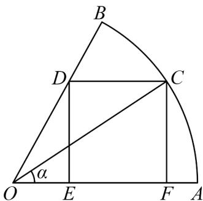

<!-- question-source:start -->
12．如图，已知扇形AOB的圆心角为 $\frac{\pi}{3}$ ，半径为1，C是弧AB上任意一点，作矩形CDEF内接于该扇形.

(1)设 $\angle AOC = \alpha$ ，试用 $\alpha$ 表示矩形 $CDEF$ 的面积，并指出 $\alpha$ 的取值范围；

(2)点 $C$ 在什么位置时，矩形 $CDEF$ 的面积最大？并说明理由。
<!-- question-source:end -->

![[高中/课堂同步/题库/人教A版高中数学同步讲义(2026)/01_必修第一册/第五章 三角函数/第五章 三角函数（高效培优讲义）数学人教A版2019高一必修第一册/强化训练/questions/answers/Q00076609A1.md]]
