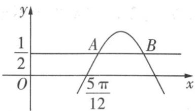

> [!faq]- 《第五章 三角函数（高效培优讲义）数学人教A版2019高一必修第一册》官方解析
>
> > [!success]- **【答案】**  A. $-\frac{\sqrt{3}}{2}$ B. $-\frac{\sqrt{2}}{2}$ C. $-\frac{1}{2}$ D. $\frac{1}{2}$
>
> > [!note]- **【解析】**
> > 设 $A(x_{1},\frac{1}{2}),B(x_{2},\frac{1}{2})$ ，由 $AB = \frac{\pi}{3}$ ，得 $x_{2} - x_{1} = \frac{\pi}{3}$ ，由 $\cos x = \frac{1}{2}$ ，得 $x = \frac{\pi}{3} +2k\pi$ 或 $x = -\frac{\pi}{3} +2k\pi ,k\in \mathbf{Z}$ 由图知 $x_{1},x_{2}$ 分别在相邻的两个递增与递减区间内，则 $\omega x_2 + \varphi -(\omega x_1 + \varphi) = \frac{\pi}{3} -(-\frac{\pi}{3}) = \frac{2\pi}{3}$
> >
> > 即 $\omega (x_{2} - x_{1}) = \frac{2\pi}{3}$ ，解得 $\omega = 2$ ，由 $f(\frac{5\pi}{12}) = \cos (\frac{5\pi}{6} +\varphi) = 0$ 及函数 $f(x)$ 的图象在 $\frac{5\pi}{12}$ 所在单调区间上递增，得 $\frac{5\pi}{6} +\varphi = \frac{3\pi}{2} +2k\pi ,k\in \mathbf{Z}$ ，即 $\varphi = \frac{2\pi}{3} +2k\pi ,k\in \mathbf{Z}$ ，因此 $f(x) = \cos (2x + \frac{2\pi}{3} +2k\pi) = \cos (2x + \frac{2\pi}{3})$ ，所以 $f(\frac{\pi}{3}) = \cos (\frac{2\pi}{3} +\frac{2\pi}{3}) = \cos \frac{4\pi}{3} = -\frac{1}{2}.$
> >
> > 故选 **C**
