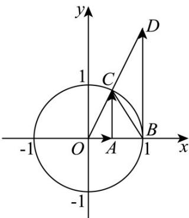

> [!faq]- 《第五章 三角函数（高效培优讲义）数学人教A版2019高一必修第一册》官方解析
>
> > [!success]- **【答案】** A. a < c < d < b B. b < a < c < d C. c < d < b < a D. d < a < b < c
>
> > [!note]- **【解析】**
> > 作出单位圆， $\angle BOC = \frac{4}{3}$ ，用三角函数线进行求解，如图所示，因为 $\frac{\pi}{2} > \frac{4}{3} > \frac{\pi}{4}$ ，所以有 $OA < AC < BD$ ，所以 $\cos \frac{4}{3} < \sin \frac{4}{3} < \tan \frac{4}{3}$ ，即 $b < a < d$ 。
> >
> > 由图可知 $S_{\triangle BOC} < S_{扇形BOC} < S_{Rt^{\triangle OBD}}$ ，即 $\frac{1}{2}\sin \frac{4}{3} < \frac{1}{2}\times \frac{4}{3} < \frac{1}{2}\tan \frac{4}{3}$ ，所以 $\sin \frac{4}{3} < \frac{4}{3} < \tan \frac{4}{3}$ ，即 $a < c < d$ 综上， $b < a < c < d$ 故选：B.
> >
> > 
