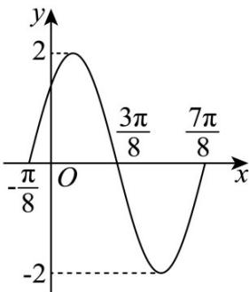

> [!faq]- 《第五章 三角函数（高效培优讲义）数学人教A版2019高一必修第一册》官方解析
>
> > [!success]- **【答案】** A
>
> > [!note]- **【解析】**
> > 把 $f(x) = 2\sin 2x - 1$ 的图象向右平移 $\frac{\pi}{6}$ 个单位长度得到 $y = 2\sin 2\left(x - \frac{\pi}{6}\right) - 1 = 2\sin \left(2x - \frac{\pi}{3}\right) - 1$ 的图象，
> >
> > 再向上平移 $^{1}$ 个单位长度得到 $g(x)=2\sin\left(2x-\frac{\pi}{3}\right)$ 的图象，
> >
> > 则 $g\left(\frac{\pi}{12}\right) = 2\sin \left(2\times \frac{\pi}{12} -\frac{\pi}{3}\right) = 2\sin \left(-\frac{\pi}{6}\right) = -1$
> >
> > 故选：A
> >
> > $$
> > x O y
> > $$
> >
> > $$
> > \theta
> > $$
> >
> > $$
> > o
> > $$
> >
> > $P(x_{0},y_{0}),|OP|=r(r>0)$ ，定义 $\mu(\theta)=\frac{y_{0}+x_{0}}{r},v(\theta)=\frac{y_{0}-x_{0}}{r}$ ，若 $v(\theta)=\frac{1}{5}$ ，且 $\theta\in(0,\pi)$ ，则 $\mu(\theta)=$ （）A. $\frac{6}{5}$ B. 1 C. $\frac{7}{5}$ D. $\frac{1}{5}$
> >
> > 【答案】C
> >
> > 【详解】因为 $v(\theta)=\frac{1}{5}$ ，且 $\theta\in(0,\pi)$ ，所以由三角函数的定义可知，
> >
> > $$
> > v (\theta) = \frac {y _ {0} - x _ {0}}{r} = \frac {r \sin \theta - r \cos \theta}{r} = \sin \theta - \cos \theta = \frac {1}{5}
> > $$
> >
> > 方法一 结合 $\sin^{2}\theta + \cos^{2}\theta = 1$ 解得 $\sin\theta = \frac{4}{5}, \cos\theta = \frac{3}{5}$
> >
> > 所以 $\mu (\theta) = \frac{y_0 + x_0}{r} = \frac{r\sin\theta + r\cos\theta}{r} = \sin \theta +\cos \theta = \frac{7}{5}$
> >
> > 方法二 两边平方得 $1 - 2\sin \theta \cos \theta = \frac{1}{25}$ ，则 $2\sin \theta \cos \theta = \frac{24}{25}$
> >
> > 则 $1 + 2\sin \theta \cos \theta = (\sin \theta + \cos \theta)^{2} = \frac{49}{25}$
> >
> > 因为 $\theta \in (0, \pi)$ ，所以 $\sin \theta > 0$ ，而 $2\sin \theta \cos \theta = \frac{24}{25} > 0$ ，得 $\cos \theta > 0$ ，
> >
> > 即 $\sin \theta +\cos \theta = \frac{7}{5}$
> >
> > 所以 $\mu (\theta) = \frac{y_0 + x_0}{r} = \frac{r\sin\theta + r\cos\theta}{r} = \sin \theta +\cos \theta = \frac{7}{5}$
> >
> > 故选：C
> >
> > $f(x) = A\sin (\omega x + \varphi)(x\in \mathbb{R},A > 0,\omega >0,|\varphi | <   \frac{\pi}{2})$ 11.函数 的部分图象如下图所示.
> >
> > 
> >
> > (1)求函数 $f(x)$ 的解析式；
> >
> > (2)求函数 $f(x)$ 的单调递增区间；
> >
> > (3)将函数 $y = f(x)$ 的图象向右平移 $\frac{5\pi}{24}$ 个单位长度，再向上平移 $^1$ 个单位长度，得到函数 $y = g(x)$ 的图象，求
> >
> > $g(x)$ 在区间 $[0, \frac{2\pi}{3}]$ 上的最值.
> >
> > 【答案】(1) $f(x)=2\sin(2x+\frac{\pi}{4})$ ;
> >
> > $$
> > [ - \frac {3 \pi}{8} + k \pi , \frac {\pi}{8} + k \pi ] (k \in Z) \tag {2}
> > $$
> >
> > (3)最大值为 3，最小值为 0.
> >
> > 【详解】（1）观察函数 $f(x)$ 的图象，得 $A = 2$ ，最小正周期 $T = \frac{7\pi}{8} - (-\frac{\pi}{8}) = \frac{2\pi}{\omega}$ ，解得 $\omega = 2$
> >
> > 由 $f(\frac{\pi}{8}) = 2$ ，得 $2\cdot \frac{\pi}{8} +\varphi = \frac{\pi}{2} +2k\pi ,k\in Z$ ，而 $|\varphi | <   \frac{\pi}{2}$ ，则 $k = 0,\varphi = \frac{\pi}{4}$
> >
> > 所以函数 $f(x)$ 的解析式是 $f(x)=2\sin(2x+\frac{\pi}{4})$
> >
> > (2) 由 (1) 知， $f(x)=2\sin(2x+\frac{\pi}{4})$
> >
> > 由 $-\frac{\pi}{2} + 2k\pi \leq 2x + \frac{\pi}{4} \leq \frac{\pi}{2} + 2k\pi, k \in \mathbb{Z}$ ，得 $-\frac{3\pi}{8} + k\pi \leq x \leq \frac{\pi}{8} + k\pi, k \in \mathbb{Z}$
> >
> > 所以函数 $f(x)$ 的单调递增区间为 $\left[-\frac{3\pi}{8}+k\pi,\frac{\pi}{8}+k\pi\right](k\in\mathbb{Z})$
> >
> > $g(x) = f(x - \frac{5\pi}{24}) + 1 = 2\sin [2(x - \frac{5\pi}{24}) + \frac{\pi}{4}] + 1 = 2\sin (2x - \frac{\pi}{6}) + 1$ （3）依题意，
> >
> > 当 $x \in [0, \frac{2\pi}{3}]$ 时， $2x - \frac{\pi}{6} \in [-\frac{\pi}{6}, \frac{7\pi}{6}]$ ，则当 $2x - \frac{\pi}{6} = \frac{\pi}{2}$ ，即 $x = \frac{\pi}{3}$ 时， $g(x)_{\max} = 3$ ；
> >
> > 当 $2x - \frac{\pi}{6} = -\frac{\pi}{6}$ 或 $2x - \frac{\pi}{6} = \frac{7\pi}{6}$ ，即 $x = 0$ 或 $x = \frac{2\pi}{3}$ 时， $g(x)_{\min} = 0$ 。
> >
> > 所以 $g(x)$ 在区间 $\left[0,\frac{2\pi}{3}\right]$ 上的最大值为 $^{3}$ ，最小值为 $^{0}$ .
