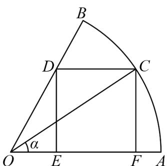

> [!faq]- 《第五章 三角函数（高效培优讲义）数学人教A版2019高一必修第一册》官方解析
>
> > [!success]- **【答案】** (1) $S_{\text{矩形}CDEF} = \frac{\sqrt{3}}{3}\sin \left(2\alpha + \frac{\pi}{6}\right) - \frac{\sqrt{3}}{6}, 0 < \alpha < \frac{\pi}{3}$ (2)当点 C 是弧 AB 的中点时，矩形 CDEF 的面积最大，最大为 $\frac{\sqrt{3}}{6}$
>
> > [!note]- **【解析】**
> > （1）由题意 $\angle AOC = \alpha \left(0 < \alpha < \frac{\pi}{3}\right)$ ，则 $CF = DE = \sin \alpha$ ， $OF = \cos \alpha$
> >
> > 
> >
> > 在 Rt△ ODE 中， $OE=\frac{DE}{\tan\frac{\pi}{3}}=\frac{\sqrt{3}}{3}\sin\alpha$ ，则 $EF=OF-OE=\cos\alpha-\frac{\sqrt{3}}{3}\sin\alpha$ ，
> >
> > 于是矩形 $CDEF$ 的面积 $S_{\text{矩形} CDEF} = EF \times CF = \left(\cos \alpha - \frac{\sqrt{3}}{3} \sin \alpha\right) \sin \alpha$
> >
> > $$
> > = \cos \alpha \sin \alpha - \frac {\sqrt {3}}{3} \sin^ {2} \alpha = \frac {\sin 2 \alpha}{2} - \frac {\sqrt {3}}{3} \left(\frac {1 - \cos 2 \alpha}{2}\right) = \frac {1}{2} \sin 2 \alpha + \frac {\sqrt {3}}{6} \cos 2 \alpha - \frac {\sqrt {3}}{6}
> > $$
> >
> > $$
> > = \frac {\sqrt {3}}{3} \left(\frac {\sqrt {3}}{2} \sin 2 \alpha + \frac {1}{2} \cos 2 \alpha\right) - \frac {\sqrt {3}}{6} = \frac {\sqrt {3}}{3} \sin \left(2 \alpha + \frac {\pi}{6}\right) - \frac {\sqrt {3}}{6}, \text {其中} 0 <   \alpha <   \frac {\pi}{3};
> > $$
> >
> > (2) 由 (1)， $S_{矩形CDEF} = \frac{\sqrt{3}}{3}\sin\left(2\alpha + \frac{\pi}{6}\right) - \frac{\sqrt{3}}{6}$
> >
> > 由于 $0 < \alpha < \frac{\pi}{3}$ ，则 $\frac{\pi}{6} < 2\alpha + \frac{\pi}{6} < \frac{5\pi}{6}$ ，
> >
> > 当 $2\alpha + \frac{\pi}{6} = \frac{\pi}{2}$ ，即当 $\alpha = \frac{\pi}{6}$ 时，矩形 $CDEF$ 的面积最大，最大值为 $\frac{\sqrt{3}}{6}$ ，此时点 $C$ 是弧 $AB$ 的中点。
> >
> > 因此，当点 C 是弧 AB 的中点时，矩形 CDEF 的面积最大，最大值为 $\frac{\sqrt{3}}{6}$ .
