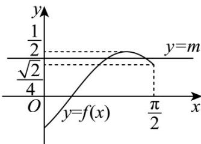

> [!faq]- 《第五章 三角函数（高效培优讲义）数学人教A版2019高一必修第一册》官方解析
>
> > [!success]- **【答案】** (1) $x = \frac{3\pi}{8} +\frac{k\pi}{2}$ ， $k\in \mathbf{Z}$ (2) $\left[-\frac{\sqrt{2}}{4},\frac{1}{2}\right]$ (3) $\left[\frac{\sqrt{2}}{4},\frac{1}{2}\right)$
>
> > [!note]- **【解析】**
> > （1）方法一 因为函数 $g(x)=\sin\left(x+\frac{\pi}{4}+\varphi\right)\left(0<\varphi<\frac{\pi}{2}\right)$ 为偶函数，
> >
> > 所以 $\frac{\pi}{4} +\varphi = \frac{\pi}{2} +k\pi ,k\in \mathbf{Z}$ ， $\varphi = \frac{\pi}{4} +k\pi$ ， $k\in \mathbf{Z}$
> >
> > 又 $0 < \varphi < \frac{\pi}{2}$ ，所以 $\varphi = \frac{\pi}{4}$ 。故 $f(x) = \frac{1}{2} \sin\left(2x - \frac{\pi}{4}\right)$
> >
> > 令 $2x - \frac{\pi}{4} = \frac{\pi}{2} + k\pi, k \in \mathbf{Z}$ ，解得 $x = \frac{3\pi}{8} + \frac{k\pi}{2}, k \in \mathbf{Z}$
> >
> > 即 $f(x)$ 图象的对称轴方程为 $x=\frac{3\pi}{8}+\frac{k\pi}{2}, k\in Z$
> >
> > 方法二 函数 $g(x)=\sin\left(x+\frac{\pi}{4}+\varphi\right)\left(0<\varphi<\frac{\pi}{2}\right)$ 为偶函数，
> >
> > 则 $g\left(\frac{\pi}{4}\right) - g\left(-\frac{\pi}{4}\right) = \sin \left(\frac{\pi}{2} +\varphi\right) - \sin \varphi = 0$ ，即 $\cos \varphi = \sin \varphi$ ，所以 $\tan \varphi = 1$
> >
> > 又 $0 < \varphi < \frac{\pi}{2}$ ，所以 $\varphi = \frac{\pi}{4}$ ，经检验，符合题意。
> >
> > (2) 当 $x \in \left[0, \frac{\pi}{2}\right]$ 时， $2x - \frac{\pi}{4} \in \left[-\frac{\pi}{4}, \frac{3\pi}{4}\right]$ ，所以 $\sin\left(2x - \frac{\pi}{4}\right) \in \left[-\frac{\sqrt{2}}{2}, 1\right]$ ，
> >
> > 所以 $\frac{1}{2}\sin \left(2x - \frac{\pi}{4}\right)\in \left[-\frac{\sqrt{2}}{4},\frac{1}{2}\right]$ ，所以 $f(x)$ 的值域为 $\left[-\frac{\sqrt{2}}{4},\frac{1}{2}\right]$
> >
> > (3) 画出函数 $f(x) = \frac{1}{2}\sin \left(2x - \frac{\pi}{4}\right)$ 在 $\left[0, \frac{\pi}{2}\right]$ 上的图象与直线 $y = m(m \in \mathbb{R})$
> >
> > 当 $x \in \left[0, \frac{\pi}{2}\right]$ 时，函数 $f(x)$ 的图象与直线 $y = m(m \in \mathbb{R})$ 有2个交点，作图如下：
> >
> > 
> >
> > 由图可知 $\frac{\sqrt{2}}{4} \leq m < \frac{1}{2}$ ，故 $m$ 的取值范围为 $\left[\frac{\sqrt{2}}{4}, \frac{1}{2}\right)$
