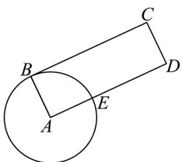

<!-- question-source:start -->
【典例1】如图，矩形ABCD在圆A外的面积为 $12-\pi$ ，DE=4，则矩形ABCD截圆A所得的BE的长为（）

A. $\pi$ B. $\frac{\pi}{2}$ C. $2\pi$ D. $\frac{3\pi}{2}$
<!-- question-source:end -->

![[高中/课堂同步/题库/人教A版高中数学同步讲义(2026)/01_必修第一册/第五章 三角函数/第五章 三角函数（高效培优讲义）数学人教A版2019高一必修第一册/题型02_扇形的弧长与面积_含最值/questions/answers/Q00076531A1.md]]
