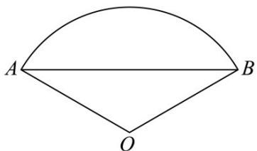

<!-- question-source:start -->
【变式2】《梦溪笔谈》是我国科技史上的杰作，其中收录了扇形弧长的近似计算公式： $l_{AB} = \frac{弦 + 2\times矢^2}{径}$ ·如

图，公式中“弦”是指扇形中 $AB$ 所对弦 $AB$ 的长，“矢”是指 $AB$ 所在圆 $O$ 的半径与圆心 $O$ 到弦 $AB$ 的距离之差，

“径”是指扇形所在圆 $O$ 的直径·若扇形的面积为 $\frac{8\pi}{3}$ ，扇形的半径为 $4$ ，利用上面公式，求得该扇形的弧长的近

似值为（）

A. 6 B. $2\sqrt{3} + 1$ C. $11 - 4\sqrt{3}$ D. $4\sqrt{3} + 1$
<!-- question-source:end -->

![[高中/课堂同步/题库/人教A版高中数学同步讲义(2026)/01_必修第一册/第五章 三角函数/第五章 三角函数（高效培优讲义）数学人教A版2019高一必修第一册/题型02_扇形的弧长与面积_含最值/questions/answers/Q00076533A1.md]]
