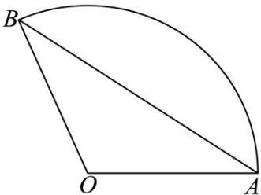

<!-- question-source:start -->
【变式3】如图，已知扇形的周长为 $6$ ，当该扇形的面积取最大值时，弦长 $AB = (\quad)$

A. $3\sin 1$ B. $3\sin 2$ C. $3\sin 1^{\circ}$ D. $3\sin 2^{\circ}$
<!-- question-source:end -->

![[高中/课堂同步/题库/人教A版高中数学同步讲义(2026)/01_必修第一册/第五章 三角函数/第五章 三角函数（高效培优讲义）数学人教A版2019高一必修第一册/题型02_扇形的弧长与面积_含最值/questions/answers/Q00076534A1.md]]
