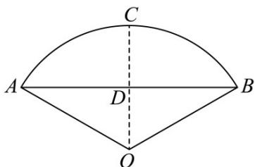

> [!faq]- 《第五章 三角函数（高效培优讲义）数学人教A版2019高一必修第一册》官方解析
>
> > [!success]- **【答案】** C
>
> > [!note]- **【解析】**
> > 设该扇形的圆心角为 $\alpha$
> >
> > 由扇形面积公式得 $\frac{1}{2} \times 4^2 \times \alpha = \frac{8\pi}{3}$ ，所以 $\alpha = \frac{\pi}{3}$
> >
> > 取AB的中点C，连接OC，交AB于点D，则 $OC\perp AB$ ，
> >
> > 
> >
> > 则 $OD = OA \times \cos \angle AOD = 4\cos \frac{\pi}{6} = 2\sqrt{3}$ ， $AB = 2AD = 2 \times 4\sin \frac{\pi}{6} = 4$ ， $CD = OC - OD = 4 - 2\sqrt{3}$ ，
> >
> > 所以扇形的弧长的近似值为 $l_{AB} =$ 弦 $+ \frac{2\times\text{矢}^2}{\text{径}} = AB + \frac{2CD^2}{2OA} = 4 + \frac{2\times(4 - 2\sqrt{3})^2}{8} = 11 - 4\sqrt{3}$
> >
> > 故选 **C**.
