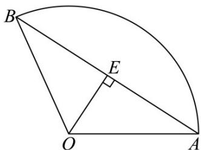

> [!faq]- 《第五章 三角函数（高效培优讲义）数学人教A版2019高一必修第一册》官方解析
>
> > [!success]- **【答案】** A
>
> > [!note]- **【解析】**
> > 设扇形的圆心角为 $\alpha$ ，半径为 r，弧长为 l，可得出 l = 6 - 2r
> >
> > 由 $\left\{\begin{aligned}r&>0\\ l&=6-2r>0\end{aligned}\right.$ 可得 0<r<3，
> >
> > 所以，扇形的面积为 $S = \frac{1}{2} lr = (3 - r)r\leq \left(\frac{3 - r + r}{2}\right)^2 = \frac{9}{4}$
> >
> > 当且仅当 $3 - r = r$ ，即 $y = \frac{3}{2}$ 时，扇形的面积 $\mathrm{S}$ 最大，此时 $l = 6 - 2r = 3$ ：
> >
> > 因为 $l=\alpha r$ ，则扇形的圆心角 $\alpha=\frac{l}{r}=\frac{3}{\frac{3}{2}}=2$
> >
> > 取线段 AB 的中点 E，由垂径定理可知 $OE \perp AB$ ，
> >
> > 
> >
> > 因为 $OA = OB$ ，则 $\angle AOE = \frac{1}{2}\angle AOB = \frac{1}{2}\times 2 = 1$
> >
> > 所以， $AB = 2AE = 2OA\sin 1 = 3\sin 1$
> >
> > 故选 **A**.
