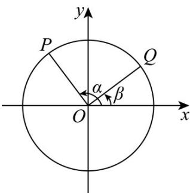

<!-- question-source:start -->
【变式1】如图，以 $Ox$ 为始边作角 $\alpha$ 与 $\beta (0 < \beta < \alpha < \pi)$ ，它们的终边分别与单位圆相交于点 $P$ 、 $Q$ ，已知点 $P$ 的坐标为 $(- \frac{3}{5}, \frac{4}{5})$ 。

$$
3 \cos \alpha - 5 \sin \alpha
$$

(1)求 $\sin \alpha -\cos \alpha$ 的值；

(2)若 $OP \perp OQ$ ，求 $3\sin\beta + 4\cos\beta$ 的值。
<!-- question-source:end -->

![[高中/课堂同步/题库/人教A版高中数学同步讲义(2026)/01_必修第一册/第五章 三角函数/第五章 三角函数（高效培优讲义）数学人教A版2019高一必修第一册/题型06_诱导公式的应用/questions/answers/Q00076546A1.md]]
