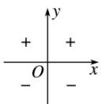
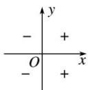
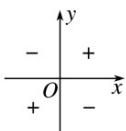

> [!faq]- 《第五章 三角函数（高效培优讲义）数学人教A版2019高一必修第一册》官方解析
>
> > [!success]- **【答案】** $(1)\sin\theta$ ; $(2)-\frac{11}{10}$ $$ \frac {\sin (\theta - 5 \pi) \cos \left(\theta - \frac {\pi}{2}\right) \cos (8 \pi - \theta)}{\sin \left(\theta - \frac {3 \pi}{2}\right) \sin (- \theta - 4 \pi)} = \frac {- \sin \theta \sin \theta \cos \theta}{- \cos \theta \sin \theta} = \sin \theta ; $$ (2) 因为 $\alpha \in (0, \pi)$ ， $\sin \alpha + 2\cos \alpha = -1 < 0$ ，可得 $\alpha \in \left(\frac{\pi}{2}, \pi\right)$ 由 $\left(\sin \alpha + 2\cos \alpha\right)^2 = 1$ 得， $\sin^2 \alpha + 4\sin \alpha \cos \alpha + 4\cos \alpha^2 = 1 + 4\sin \alpha \cos \alpha + 3\cos \alpha^2 = 1$ 所以 $\cos\alpha(4\sin\alpha+3\cos\alpha)=0$ ，可得 $\cos\alpha=0$ 或 $4\sin\alpha+3\cos\alpha=0$ 因为 $\alpha\in\left(\frac{\pi}{2},\pi\right)$ ，所以 $\cos\alpha=0$ 舍去， 由 $4\sin \alpha = -3\cos \alpha$ ，得 $\sin \alpha = -\frac{3}{4}\cos \alpha$ 若角 $\beta$ 的终边与角 $\alpha$ 关于 $x$ 轴对称， 则 $\cos \beta = \cos \alpha$ ， $\sin \beta = -\sin \alpha$ $$ \frac {\sin (\pi - \beta) - 2 \sin \left(\frac {3 \pi}{2} - \beta\right)}{2 \cos \left(\frac {\pi}{2} + \beta\right) + \cos (5 \pi + \beta)} = \frac {\sin \beta + 2 \cos \beta}{- 2 \sin \beta - \cos \beta} = \frac {- \sin \alpha + 2 \cos \alpha}{2 \sin \alpha - \cos \alpha} = \frac {\frac {3}{4} \cos \alpha + 2 \cos \alpha}{- \frac {3}{2} \cos \alpha - \cos \alpha} = \frac {\frac {1 1}{4}}{- \frac {5}{2}} = - \frac {1 1}{1 0}. $$ ## 方法技巧 1、诱导公式的记忆方法 ①口诀记忆法：奇变偶不变，符号看象限 “奇变偶不变，符号看象限”精析： (1) 适用范围： $\frac{\pi}{2}\cdot k\pm\alpha,k\in Z$ （即角中必须出现 $\frac{\pi}{2}$ 的整数倍才能使用诱导公式） (2) 奇？偶？（使用诱导公式时先判断是否需要变函数名） 奇：指 k 是奇数（也即 $\frac{\pi}{2}$ 的系数是奇数）如 $\frac{\pi}{2} \pm \alpha, \frac{3\pi}{2} \pm \alpha, \frac{5\pi}{2} \pm \alpha, \cdots$ 变：指的是函数名发生改变， $\sin \rightarrow \cos ,\cos \rightarrow \sin ,\tan \rightarrow \frac{1}{\tan}$ 偶：指 $\mathbf{k}$ 是偶数（也即 $\frac{\pi}{2}$ 的系数是偶数）如 $-\alpha, \pi \pm \alpha, 2\pi \pm \alpha \dots$ 不变：函数名不发生变化 (3) 三角函数在各个象限的符号  sin α  cos $\alpha$  tan α 口诀：“一全正，二正弦，三正切，四余弦”. (4) 各个角所在的象限（无论 $\alpha$ 具体是什么角，都将其视为锐角） $\frac{\pi}{2} - \alpha$ 第一象限 $\frac{\pi}{2} + \alpha$ 第二象限 $\pi + \alpha$ 第三象限 $\pi - \alpha$ 第二象限 $-\alpha$ 第四象限 $\frac{3\pi}{2} - \alpha$ 第三象限 $\frac{3\pi}{2} + \alpha$ 第四象限 $\alpha - \frac{\pi}{2}$ 第四象限 例： $\sin (360^{\circ} + 120^{\circ}) = \sin 120^{\circ}$ ， $\sin (270^{\circ} + 120^{\circ}) = -\cos 120^{\circ}$ (5) 确定符号：判断符号时看原函数名，而非变化之后的函数名 (6) 实例：诱导公式 1-6 (7) 补充： $\sin\left(\frac{3\pi}{2}-\alpha\right)=-\cos\alpha,\cos\left(\frac{3\pi}{2}-\alpha\right)=-\sin\alpha,\tan\left(\frac{3\pi}{2}-\alpha\right)=\frac{1}{\tan\alpha}$ $\sin \left(\frac{3\pi}{2} +\alpha\right) = -\cos \alpha ,\cos \left(\frac{3\pi}{2} +\alpha\right) = \sin \alpha ,\tan \left(\frac{3\pi}{2} +\alpha\right) = -\frac{1}{\tan \alpha}$ (8) 特殊： $$ \sin (\alpha - \frac {\pi}{2}) = - \sin (\frac {\pi}{2} - \alpha) = - \cos \alpha $$ $\sin (\alpha -\frac{\pi}{2}) = -\cos \alpha$ （直接判断 $\alpha -\frac{\pi}{2}$ 在第四象弦， $\sin$ 值为负值） $$ \sin (\alpha - \frac {3 \pi}{2}) = - \sin (\frac {3 \pi}{2} - \alpha) = \cos \alpha $$ $$ \sin (\alpha - \frac {3 \pi}{2}) = \sin (\alpha - \frac {3 \pi}{2} + 2 \pi) = \sin (\frac {\pi}{2} - \alpha) = \cos \alpha $$ $$ \sin \left(\frac {5 \pi}{2} + \alpha\right) = \sin \left(\frac {\pi}{2} + \alpha\right) = \cos \alpha $$ 2、利用诱导公式求任意角三角函数值的步骤 (1) “负化正”——用公式一或三来转化； (2) “大化小”——用公式一将角化为 $0^{\circ}$ 到 $360^{\circ}$ 间的角； (3) “小化锐”——用公式二或四将大于 $90^{\circ}$ 的角转化为锐角； (4) “锐求值”——得到锐角的三角函数后求值.
>
> > [!note]- **【解析】**
> > 本题未单列解析。
