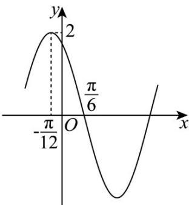

<!-- question-source:start -->
【变式1】已知函数 $f(x) = A\cos (\omega x + \varphi)(A > 0, \omega > 0, 0 < \varphi < \pi)$ 的部分图象如图所示.

(1)求 $f(x)$ 的解析式；

(2)求 $f(x)$ 的单调递减区间；

(3)求 $f(x)$ 在区间 $\left[\frac{7\pi}{6},\frac{7\pi}{4}\right]$ 上的值域.
<!-- question-source:end -->

![[高中/课堂同步/题库/人教A版高中数学同步讲义(2026)/01_必修第一册/第五章 三角函数/第五章 三角函数（高效培优讲义）数学人教A版2019高一必修第一册/题型08_三角函数的值域_最值/questions/answers/Q00076554A1.md]]
