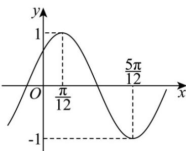

<!-- question-source:start -->
【变式3】已知函数 $f(x) = \sin (\omega x + \varphi)\left(\omega >0,|\varphi | <   \frac{\pi}{2}\right)$ 的部分图象如图所示

(1)求 $f(x)$ 的解析式；

(2)将函数 $y = f(x)$ 的图象上各点纵坐标不变，横坐标变为原来的 $\frac{3}{2}$ ，得到函数 $y = g(x)$ ，再将 $y = g(x)$ 图象

向右平移 $\frac{\pi}{6}$ 个单位长度，得到函数 $y = h(x)$ 的图象，求函数 $y = h(x)$ 在 $\left[-\frac{\pi}{12}, \frac{3\pi}{8}\right]$ 上的值域；

(3)若函数 $y = f(x) - k$ 在区间 $\left[-\frac{\pi}{6}, \frac{\pi}{4}\right]$ 上恰好有两个零点，求实数 $k$ 的取值范围.
<!-- question-source:end -->

![[高中/课堂同步/题库/人教A版高中数学同步讲义(2026)/01_必修第一册/第五章 三角函数/第五章 三角函数（高效培优讲义）数学人教A版2019高一必修第一册/题型08_三角函数的值域_最值/questions/answers/Q00076556A1.md]]
