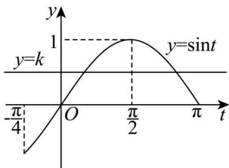

> [!faq]- 《第五章 三角函数（高效培优讲义）数学人教A版2019高一必修第一册》官方解析
>
> > [!success]- **【答案】** (1) $f(x)=\sin(3x+\frac{\pi}{4})$ (2) $\left[-\frac{\sqrt{2}}{2},1\right]$ (3) $k\in[0,1)$
>
> > [!note]- **【解析】**
> > （1）由题设 $\frac{T}{2} = \frac{2\pi}{2\omega} = \frac{5\pi}{12} -\frac{\pi}{12} = \frac{\pi}{3}$ 所以 $T = \frac{2\pi}{3}$ ，则 $\omega = \frac{2\pi}{T} = 3$ ，故 $f(x) = \sin (3x + \varphi)$
> >
> > 由 $f(\frac{\pi}{12}) = \sin (\frac{\pi}{4} +\varphi) = 1$ ，则 $\frac{\pi}{4} +\varphi = \frac{\pi}{2} +2k\pi ,k\in \mathbb{Z}$ ，即 $\varphi = \frac{\pi}{4} +2k\pi ,k\in \mathbb{Z}$
> >
> > 又 $|\varphi|<\frac{\pi}{2}$ ，当 $k = 0$ 时，则 $\varphi = \frac{\pi}{4}$ ，故 $f(x) = \sin (3x + \frac{\pi}{4})$
> >
> > (2) 将函数 $y = f(x)$ 的图象上各点横坐标伸长为原来的 $\frac{3}{2}$ 倍，纵坐标不变，得到函数 $g(x) = \sin(2x + \frac{\pi}{4})$ ，再将
> >
> > $y = g(x)$ 图象向右平移 $\frac{\pi}{6}$ 个单位长度，
> >
> > 所以 $h(x)=\sin\left[2\left(x-\frac{\pi}{6}\right)+\frac{\pi}{4}\right]=\sin\left(2x-\frac{\pi}{12}\right)$ ;
> >
> > $x\in \left[-\frac{\pi}{12},\frac{3\pi}{8}\right]$ ，则 $2x - \frac{\pi}{12}\in [-\frac{\pi}{4},\frac{2\pi}{3} ]$
> >
> > 所以 $\sin \left(2x - \frac{\pi}{12}\right) \in \left[-\frac{\sqrt{2}}{2}, 1\right]$
> >
> > 所以函数 $y = h(x)$ 在 $\left[-\frac{\pi}{12}, \frac{3\pi}{8}\right]$ 上的值域： $\left[-\frac{\sqrt{2}}{2}, 1\right]$
> >
> > (3) $x \in \left[-\frac{\pi}{6}, \frac{\pi}{4}\right]$ ，则 $t = 3x + \frac{\pi}{4} \in \left[-\frac{\pi}{4}, \pi\right]$
> >
> > 由 $y = \sin t$ 在 $t \in [-\frac{\pi}{4}, \frac{\pi}{2})$ 上单调递增，对应值域为 $[-\frac{\sqrt{2}}{2}, 1)$ ;
> >
> > 在 $t \in (\frac{\pi}{2}, \pi]$ 上单调递减，对应值域为 $[0,1)$ ；
> >
> > 
> >
> > 函数 $y = f(x) - k$ 在区间 $\left[-\frac{\pi}{6}, \frac{\pi}{4}\right]$ 上有且仅有两个零点，
> >
> > 即 $k = f(x)$ 在 $\left[-\frac{\pi}{6},\frac{\pi}{4}\right]$ 上只有两个解，有图可知 $k\in [0,1)$
