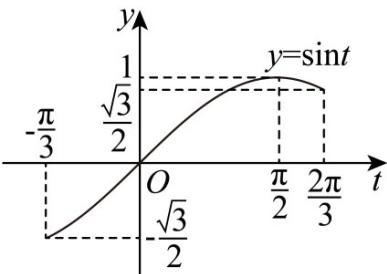

> [!faq]- 《第五章 三角函数（高效培优讲义）数学人教A版2019高一必修第一册》官方解析
>
> > [!success]- **【答案】** (1) $T=\pi\left[-\frac{\pi}{12}+k\pi,\frac{5\pi}{12}+k\pi\right],k\in\mathbf{Z}$ (2) $\left[\sqrt{3}, 2\right), f(x_1 + x_2) = -\frac{\sqrt{3}}{2}$
>
> > [!note]- **【解析】**
> > （1）由 $f(x) = \sin \left(2x - \frac{\pi}{3}\right)$ 可得函数 $f(x)$ 的最小正周期为 $T = \frac{2\pi}{2} = \pi$
> >
> > 令 $-\frac{\pi}{2} + 2k\pi \leq 2x - \frac{\pi}{3} \leq \frac{\pi}{2} + 2k\pi, k \in \mathbf{Z}$ ，解得 $-\frac{\pi}{12} + k\pi \leq x \leq \frac{5\pi}{12} + k\pi, k \in \mathbf{Z}$
> >
> > 所以 $f(x)$ 的单调递增区间为 $\left[-\frac{\pi}{12} + k\pi, \frac{5\pi}{12} + k\pi\right], k \in \mathbf{Z}$
> >
> > (2) 因为 $x \in \left[0, \frac{\pi}{2}\right]$ ，所以令 $t = 2x - \frac{\pi}{3} \in \left[-\frac{\pi}{3}, \frac{2\pi}{3}\right]$ ， $y = \sin t$ 在 $\left[-\frac{\pi}{3}, \frac{2\pi}{3}\right]$ 内的图象如图所示.
> >
> > 
> >
> > 令 $g(x) = f(x) - \frac{a}{2} = 0$ ，可得 $f(x) = \frac{a}{2}$ ，即 $\sin t = \frac{a}{2}$
> >
> > 若函数 $g(x)=f(x)-\frac{a}{2},x\in\left[0,\frac{\pi}{2}\right]$ 有两个零点 $x_{1},x_{2}$
> >
> > 则 $y = \sin t$ 与 $y = \frac{a}{2}$ 在 $\left[-\frac{\pi}{3},\frac{2\pi}{3}\right]$ 内的图象有两个交点 $t_1,t_2$
> >
> > 结合图象可得 $\frac{\sqrt{3}}{2} \leq \frac{a}{2} < 1, t_1 + t_2 = 2x_1 - \frac{\pi}{3} + 2x_2 - \frac{\pi}{3} = \pi$ ，即 $\sqrt{3} \leq a < 2, x_1 + x_2 = \frac{5\pi}{6}$
> >
> > 所以实数 $a$ 的取值范围为 $\left[\sqrt{3},2\right),f\left(x_1 + x_2\right) = \sin \left(\frac{5\pi}{3} -\frac{\pi}{3}\right) = \sin \left(\pi +\frac{\pi}{3}\right) = -\sin \frac{\pi}{3} = -\frac{\sqrt{3}}{2}$
> >
> > ## 方法技巧
> >
> > （1）定义法：直接利用周期函数的定义求周期。
> >
> > (2) 公式法，即将函数化为 $y = A \sin (\omega x + \varphi) + B$ 或 $y = A \cos (\omega x + \varphi) + B$ 的形式，再利用 $T = \frac{2\pi}{|\omega|}$ 求得，
> >
> > $y = \tan (\omega x + \varphi)$ 的最小正周期为
> >
> > （3）图象法：利用三角函数图象的特征求周期．如：相邻两最高点(最低点)之间为一个周期，最高点与相邻的最低点之间为半个周期．相邻两对称轴间的距离为，相邻两对称中心间的距离也为,相邻对称轴和对称中心间的距离也为 $\frac{T}{4}$ ，函数的对称轴一定经过图象的最高点或最低点．
