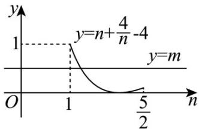

> [!faq]- 《第五章 三角函数（高效培优讲义）数学人教A版2019高一必修第一册》官方解析
>
> > [!success]- **【答案】** (1) $f(x)=\cos\left(2x-\frac{\pi}{6}\right)$ ，单调增区间： $\left[-\frac{5\pi}{12}+k\pi,\frac{\pi}{12}+k\pi\right](k\in Z)$ (2) $m\in [0,1]$
>
> > [!note]- **【解析】**
> > （1）由 $T=\frac{2\pi}{2|\omega|}=\pi$ ，得 $|\omega|=1$ ，
> >
> > 当 $\omega = 1$ 时，因为 $\left(\frac{5\pi}{6},0\right)$ 为它的一个对称中心所以 $2\times \frac{5}{6}\pi +\varphi = \frac{\pi}{2} +k\pi (k\in Z)$
> >
> > 所以 $\varphi = -\frac{7\pi}{6} + k\pi (k\in Z)$
> >
> > 又 $\left|\varphi\right| \leq \frac{\pi}{2}$ ，所以 $\varphi = -\frac{\pi}{6}$ ，所以 $f(x) = \cos\left(2x - \frac{\pi}{6}\right)$ ;
> >
> > 当 $\omega = -1$ 时，因为 $\left(\frac{5\pi}{6},0\right)$ 为它的一个对称中心所以 $-2\times \frac{5}{6}\pi +\varphi = \frac{\pi}{2} +k\pi (k\in Z)$
> >
> > 所以 $\varphi = \frac{13\pi}{6} + k\pi (k\in Z)$
> >
> > 又 $\left|\varphi\right|\leq\frac{\pi}{2}$ ，所以 $\varphi=\frac{\pi}{6}$ ，所以 $f(x)=\cos\left(-2x+\frac{\pi}{6}\right)=\cos\left(2x-\frac{\pi}{6}\right)$ ；
> >
> > 令 $-\pi + 2k\pi \leq 2x - \frac{\pi}{6} \leq 2k\pi \Rightarrow -\frac{5\pi}{12} + k\pi \leq x \leq \frac{\pi}{12} + k\pi$ ， $k \in \mathbb{Z}$ ，
> >
> > 所以单调增区间： $\left[-\frac{5\pi}{12}+k\pi,\frac{\pi}{12}+k\pi\right](k\in Z)$ ;
> >
> > (2) 由 $-\frac{\pi}{12} \leq x \leq \frac{5\pi}{12}$ ，得 $-\frac{\pi}{3} \leq 2x - \frac{\pi}{6} \leq \frac{2\pi}{3}$ ，故 $-\frac{1}{2} \leq \cos\left(2x - \frac{\pi}{6}\right) \leq 1$
> >
> > 因此函数 $y = f(x)$ 的值域为 $\left[-\frac{1}{2}, 1\right]$ .
> >
> > $$
> > t = f (x) = \cos \left(2 x - \frac {\pi}{6}\right), \text {则} t \in \left[ - \frac {1}{2}, 1 \right]
> > $$
> >
> > 要使关于 x 的方程 $\left[f(x)\right]^{2} + mf(x) - 2m = 0$ 在 $\left[-\frac{\pi}{12}, \frac{5\pi}{12}\right]$ 上有实数根，
> >
> > 即 $m = \frac{t^2}{2 - t}$ 在 $t\in \left[-\frac{1}{2},1\right]$ 时有实数根，令 $n = 2 - t\in \left[1,\frac{5}{2}\right]$
> >
> > 则 $m=\frac{t^{2}}{2-t}=\frac{(2-n)^{2}}{n}=n+\frac{4}{n}-4$ 在 $n\in\left[1,\frac{5}{2}\right]$ 时有实数根，
> >
> > 即 $y = m$ 与 $y = n + \frac{4}{n} -4$ 在 $n\in \left[1,\frac{5}{2}\right]$ 有交点，由图像可知 $m\in [0,1]$
> >
> > 
