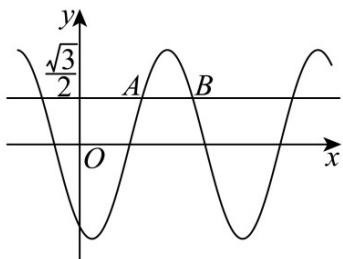

<!-- question-source:start -->
【变式3】已知 $f(x)=\frac{\sin(\pi-x)\cos(3\pi-x)\cos(-\pi-x)\cos(\frac{11\pi}{2}+x)}{\cos(2\pi-x)\sin(\pi+x)\cos(\frac{\pi}{2}+x)}$

(1)求 $f(x)$ 的解析式.

(2)若 $f(x) + 2f(x - \frac{\pi}{2}) = \sqrt{5}$ ，求 $\tan x$ 的值.

(3)若函数 $g(x) = \cos (\omega x + \frac{5\pi}{6})$ ，如图 $A,B$ 是直线 $y = \frac{\sqrt{3}}{2}$ 与曲线 $y = g(x)$ 的两个交点，若 $|AB| = \frac{\pi}{6}$ ，求 $g(x)$ 的

单调递减区间．

<!-- question-source:end -->

![[高中/课堂同步/题库/人教A版高中数学同步讲义(2026)/01_必修第一册/第五章 三角函数/第五章 三角函数（高效培优讲义）数学人教A版2019高一必修第一册/题型10_三角函数的单调性/questions/answers/Q00076564A1.md]]
