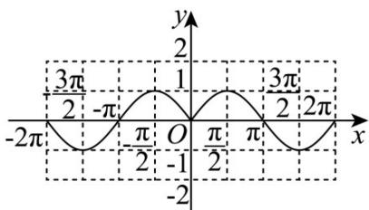

> [!faq]- 《第五章 三角函数（高效培优讲义）数学人教A版2019高一必修第一册》官方解析
>
> > [!success]- **【答案】** A
>
> > [!note]- **【解析】**
> > 易知 $f(x) = \sin |x|$ 的定义域为 $\mathbb{R}$ ，且 $f(-x) = \sin |-x| = \sin |x| = f(x)$ ，所以 $f(x)$ 偶函数，①对；当 $x > 0$ 时， $f(x) = \sin x$ ，所以当 $x > 0$ 时， $f(x) = \sin |x|$ 的图像与 $f(x) = \sin x$ 一致，
> >
> > 再结合偶函数的对称性可得整体图象如下图：
> >
> > 
> >
> > 由图象可知： $f(x)$ 在区间 $\left(\frac{\pi}{2},\pi\right)$ 单调递减；
> > - **②**：对；
> >
> > $f(x)$ 在 $(-π, π)$ 上有 1 个零点为 0，③错；函数 $f(x)$ 不具有周期性，④错；
> >
> > 所以所有正确的结论的编号是①②·
> >
> > 故选 **A**
