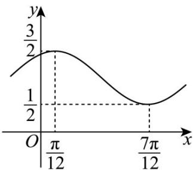

<!-- question-source:start -->
【变式3】已知函数 $f(x) = A\sin (\omega x + \varphi) + B(A > 0, \omega > 0, |\varphi| < \frac{\pi}{2})$ 的部分图象如图所示.

(1)求函数 $f(x)$ 的解析式和对称中心；

(2)将函数 $y = f(x)$ 的图象上所有的点向左平移 $\frac{\pi}{12}$ 个单位，再将所得图象上每一个点的横坐标变为原来的 $^{2}$ 倍

（纵坐标不变），最后将所得图象上所有的点向下平移 $^{1}$ 个单位（横坐标不变），得到函数 $y = g(x)$ 的图象。

①设 $h(x) = f(x) - 4\sqrt{3} g^2 (x) + \frac{\sqrt{3}}{2}$ ，求函数 $h(x)$ 在 $\left[\frac{\pi}{12},\frac{\pi}{2}\right]$ 上的值域；

②方程 $g\left(x + \frac{2\pi}{3}\right) - m = 0$ 在 $\left[-\frac{13\pi}{12},\frac{4\pi}{3}\right]$ 上有三个不相等的实数根 $x_{1},x_{2},x_{3}(x_{1} <   x_{2} <   x_{3})$ ，求 $\tan (x_1 + 2x_2 + x_3)$ 的

值.
<!-- question-source:end -->

![[高中/课堂同步/题库/人教A版高中数学同步讲义(2026)/01_必修第一册/第五章 三角函数/第五章 三角函数（高效培优讲义）数学人教A版2019高一必修第一册/题型19_三角函数图象变换的综合运用/questions/answers/Q00076600A1.md]]
