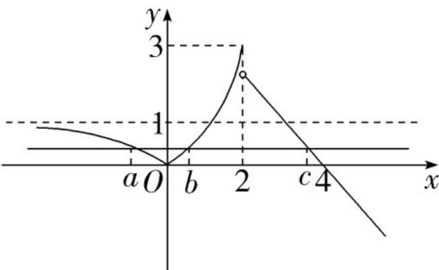

> [!faq]- 《专题01 指数及指数函数的五大常考题型（高效培优专项训练）》官方解析
>
> > [!success]- **【答案】** D
>
> > [!note]- **【解析】**
> > 作出函数 $f(x)$ 的图象，如图，
> >
> > 
> >
> > 当 $x < 0$ 时， $f(x) = \left|2^{x} - 1\right| = 1 - 2^{x} \in (0,1)$ ，
> >
> > 由图可知， $f(a) = f(b) = f(c) \in (0,1)$ ，即 $4 - c \in (0,1)$
> >
> > 得 $3 < c < 4$ ，则 $8 < 2^{c} < 16$
> >
> > 由 $f(a) = f(b)$ ，即 $\left|2^a - 1\right| = \left|2^b - 1\right|$ ，得 $1 - 2^a = 2^b - 1$ ，求得 $2^a + 2^b = 2$ ， $\therefore 2^{a+c} + 2^{b+c} = 2^c (2^a + 2^b) = 2 \times 2^c \in (16,32)$ ，
> >
> > 故选 **D**.
