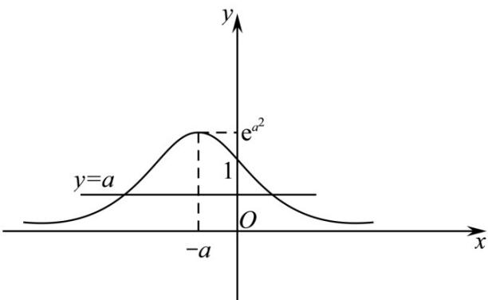

> [!faq]- 《专题01 指数及指数函数的五大常考题型（高效培优专项训练）》官方解析
>
> > [!success]- **【答案】** A. 若 $f(x)$ 是偶函数，则 $a = 0$ B. $f(x)$ 的值域为 $(0,1)$ C. $f(x)$ 在 $[-a, +\infty)$ 上单调递减 D. 当 $a \in (0,1)$ 时，方程 $f(x) - a = 0$ 都有两个实数根
>
> > [!note]- **【解析】**
> > 对于 A 选项，由于 $f(x)$ 是偶函数，则 $f(x)=\mathrm{e}^{-x^{2}-2ax}=\mathrm{e}^{-x^{2}+2ax}=f(-x)$ 即可得 a=0 ，故 A 正确
> >
> > 对于 B 选项，注意到 $-x^{2}-2ax=-\left(x+a\right)^{2}+a^{2}\leq a^{2}$ ，又 $y=e^{x}$ 在 R 上单调递增，
> >
> > 则 $f(x)$ 值域为 $\left(0, \mathrm{e}^{a^2}\right]$ ，故 $\mathsf{B}$ 错误
> >
> > 对于 $C$ 选项，由 $B$ 选项可知， $y = -x^2 - 2ax$ 在 $[-a, +\infty)$ 上单调递减，又 $y = e^x$ 在 $R$ 上单调递增，由复合函数单调性“同增异减”可知， $f(x)$ 在 $[-a, +\infty)$ 上单调递减，故 $C$ 正确.
> >
> > 对于 D 选项，由选项 B，C 可知， $f(x)$ 在 $(-∞,-a)$ 上单调递增， $f(x)$ 在 $[-a,+∞)$ 上单调递减，据此可画出 $f(x)$ 大致图像如下，由图可知 $f(x)$ 图像最高点所对应的纵坐标为 $e^{a^2}>1$ ·则当 $a∈(0,1)$ 时，y=a与 $f(x)$ 图像交点个数为2，即方程 $f(x)-a=0$ 都有两个实数根，故D正确·
> >
> > 故选：ACD
> >
> > 
