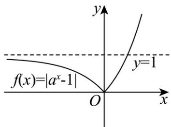
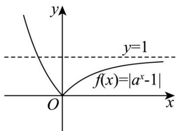

> [!faq]- 《专题01 指数及指数函数的五大常考题型（高效培优专项训练）》官方解析
>
> > [!success]- **【答案】** A. 函数 $f(x) = 3a^{x - 1} - 2$ （ $a > 0$ 且 $a \neq 1$ ）的图象恒过定点(1,1) $$ y = f (x + 1) $$ $$ y = f (x) $$ $$ g (x) = \sqrt {x ^ {2} + 4 x - 1 2} $$ $$ \left[ - 2, + \infty\right) $$ D．若直线 y=2a 与函数 $f(x)=\left|a^{x}-1\right|$ 的图象有两个公共点，则实数 a 的取值范围是 $\left(0,\frac{1}{2}\right)$
>
> > [!note]- **【解析】**
> > 对于 $\mathsf{A}$ ，当 $x = 1$ 时， $f(1) = 3a^0 - 2 = 1$
> >
> > 所以函数 $f(x)$ 的图象恒过定点 $(1,1)$ ，故 $\mathsf{A}$ 正确；
> >
> > 对于 $^{B}$ ，因为函数 $y = f(x + 1)$ 是奇函数，所以函数 $y = f(x + 1)$ 的图象关于点 $(0,0)$ 对称，
> >
> > 因为函数 $y = f(x)$ 的图象可由函数 $y = f(x + 1)$ 的图象向右平移1个单位得到，
> >
> > 所以函数 $y = f(x)$ 的图像关于点 $(1,0)$ 对称，故 B 正确；
> >
> > 对于 C，设 $u = x^{2} + 4x - 12$ ，则 $y = \sqrt{u}$
> >
> > 由 $x^{2}+4x-12$ 0 ，得 $x\leq-6$ 或 x 2 ，
> >
> > 因为 $y = \sqrt{u}$ 在 $[0, +\infty)$ 单调递增，
> >
> > $u = x^{2} + 4x - 12$ 在 $(-∞, -6]$ 单调递减，在 $[2, +∞)$ 单调递增，
> >
> > 所以 $g(x)=\sqrt{x^{2}+4x-12}$ 的单调递增区间为 $\left[2,+\infty\right)$ ，故 C 错误；
> >
> > 对于 $\mathbb{D}$ ，当 $a > 1$ 时，函数 $f(x) = |a^x - 1|$ 的图象下图所示，
> >
> > 
> >
> > 当 $0 < a < 1$ 时，函数 $f(x) = |a^x - 1|$ 的图象下图所示，
> >
> > 
> >
> > 则当 $0 < 2a < 1$ 时，直线 $y = 2a$ 与函数 $f(x) = \left|a^x - 1\right|$ 的图象有两个公共点，
> >
> > 所以 $0 < a < \frac{1}{2}$ ，故 D 正确.
> >
> > 故选 **ABD**.
