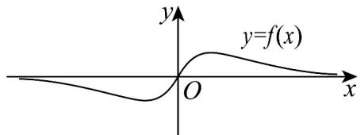

## 题型三：对数函数的定义域、值域及解析式

21. 函数 $f(x)$ 的部分图象如图所示，则 $f(x)$ 可以是（）

【答案】

A. $f(x) = x\ln x$ B. $f(x) = x - \frac{1}{x}$

C. $f(x) = \frac{x}{\mathrm{e}^{|x|}}$ D. $f(x) = \mathrm{e}^{x} + \mathrm{e}^{-x}$

【答案】C

【详解】由图象可知，函数 $f(x)$ 为R上的奇函数，·

对于 A 选项，函数 $f(x)=x\ln x$ 的定义域为 $(0,+\infty)$ ，A 不满足；

对于 B 选项，函数 $f(x)=x-\frac{1}{x}$ 的定义域为 $\left\{x\mid x\neq0\right\}$ ，B 不满足；

对于 $\mathbb{D}$ 选项，函数 $f(x) = \mathrm{e}^x +\mathrm{e}^{-x}$ 的定义域为 $\mathbf{R}$ ，且 $f(-x) = \mathrm{e}^{-x} + \mathrm{e}^{x} = f(x)$

故函数 $f(x)=\mathrm{e}^{x}+\mathrm{e}^{-x}$ 为偶函数，D 不满足；

对于 C 选项，函数 $f(x)=\frac{x}{\mathrm{e}^{|x|}}$ 的定义域为 R，

$f(-x) = -\frac{x}{\mathrm{e}^{| - x|}} = -\frac{x}{\mathrm{e}^{|x|}} = -f(x)$ ，则函数 $f(x)$ 为奇函数，C满足

故选：C.

![[高中/课堂同步/题库/人教A版高中数学同步讲义(2026)/01_必修第一册/第四章 指数函数与对数函数/专题02 对数及对数函数的六大常考题型（高效培优专项训练）/题型三_对数函数的定义域_值域及解析式/questions/Q00075305.md]]
![[高中/课堂同步/题库/人教A版高中数学同步讲义(2026)/01_必修第一册/第四章 指数函数与对数函数/专题02 对数及对数函数的六大常考题型（高效培优专项训练）/题型三_对数函数的定义域_值域及解析式/questions/Q00075306.md]]
![[高中/课堂同步/题库/人教A版高中数学同步讲义(2026)/01_必修第一册/第四章 指数函数与对数函数/专题02 对数及对数函数的六大常考题型（高效培优专项训练）/题型三_对数函数的定义域_值域及解析式/questions/Q00075307.md]]
![[高中/课堂同步/题库/人教A版高中数学同步讲义(2026)/01_必修第一册/第四章 指数函数与对数函数/专题02 对数及对数函数的六大常考题型（高效培优专项训练）/题型三_对数函数的定义域_值域及解析式/questions/Q00075308.md]]
![[高中/课堂同步/题库/人教A版高中数学同步讲义(2026)/01_必修第一册/第四章 指数函数与对数函数/专题02 对数及对数函数的六大常考题型（高效培优专项训练）/题型三_对数函数的定义域_值域及解析式/questions/Q00075309.md]]
![[高中/课堂同步/题库/人教A版高中数学同步讲义(2026)/01_必修第一册/第四章 指数函数与对数函数/专题02 对数及对数函数的六大常考题型（高效培优专项训练）/题型三_对数函数的定义域_值域及解析式/questions/Q00075310.md]]
![[高中/课堂同步/题库/人教A版高中数学同步讲义(2026)/01_必修第一册/第四章 指数函数与对数函数/专题02 对数及对数函数的六大常考题型（高效培优专项训练）/题型三_对数函数的定义域_值域及解析式/questions/Q00075311.md]]
![[高中/课堂同步/题库/人教A版高中数学同步讲义(2026)/01_必修第一册/第四章 指数函数与对数函数/专题02 对数及对数函数的六大常考题型（高效培优专项训练）/题型三_对数函数的定义域_值域及解析式/questions/Q00075312.md]]
