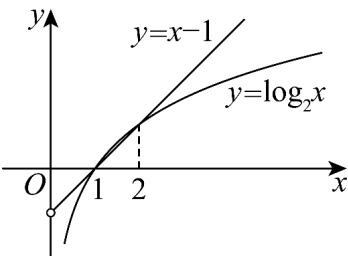

> [!faq]- 《专题02 对数及对数函数的六大常考题型（高效培优专项训练）》官方解析
>
> > [!success]- **【答案】** D
>
> > [!note]- **【解析】**
> > 因为 $f(x)=\log_{2}x-x+1$ 的定义域为 $(0,+\infty)$
> >
> > 因为 $f(1) = \log_2 1 - 1 + 1 = 0$ ， $f(2) = \log_2 2 - 2 + 1 = 0$
> >
> > 由 $f(x) < 0$ 可得 $\log_2 x < x - 1$ ，即 $y = x - 1$ 的图象在 $y = \log_2 x$ 图象的上方，
> >
> > 画出 $y = \log_2 x, y = x - 1$ 的图象，如下图，
> >
> > 
> >
> > 由图可知：不等式 $f(x) < 0$ 的解集是 $(0,1) \cup (2, +\infty)$ .
> >
> > 故选 **D**.
