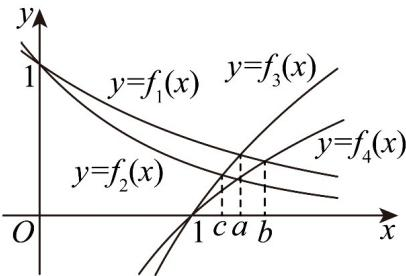

> [!faq]- 《专题02 对数及对数函数的六大常考题型（高效培优专项训练）》官方解析
>
> > [!success]- **【答案】** B
>
> > [!note]- **【解析】**
> > 在同一直角坐标系中作出 $f_{1}(x) = \left(\frac{1}{2}\right)^{x}, f_{2}(x) = \left(\frac{1}{3}\right)^{x}, f_{3}(x) = \log_{2} x, f_{4}(x) = \log_{3} x$ 的图象，其中 $a$ 是 $y = f_{1}(x)$ 与 $y = f_{3}(x)$ 的交点横坐标， $b$ 是 $y = f_{1}(x)$ 与 $y = f_{4}(x)$ 的交点横坐标， $c$ 是 $y = f_{2}(x)$ 与 $y = f_{3}(x)$ 的交点横坐标，观察图象得 $c < a < b$
> >
> > 所以 a, b, c 的大小关系是 c < a < b.
> >
> > 故选：B
> >
> > 
