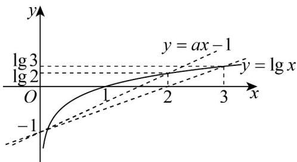

> [!faq]- 《专题02 对数及对数函数的六大常考题型（高效培优专项训练）》官方解析
>
> > [!success]- **【答案】** A
>
> > [!note]- **【解析】**
> > 由题意得 $\lg x > ax - 1(a > 0)$ 的解中，有且仅有两个整数，
> >
> > 即函数 $y = \lg x$ 在直线 $y = ax - 1 (a > 0)$ 上方的图象中有且仅有两个横坐标为整数的点，
> >
> > 其中直线 $y = ax - 1(a > 0)$ 恒过点 $(0, -1)$
> >
> > 如下图所示：
> >
> > 
> >
> > 显然当 $y = ax - 1$ 满足 $\left\{ \begin{array}{ll}2a - 1 <   \lg 2\\ 3a - 1 & \lg 3 \end{array} \right.$ 时，满足要求，
> >
> > 解得 $a \in \left[\frac{1}{3} \lg 30, \frac{1}{2} \lg 20\right)$ .
> >
> > 故选 **A**
