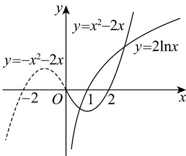

> [!faq]- 《专题02 对数及对数函数的六大常考题型（高效培优专项训练）》官方解析
>
> > [!success]- **【答案】** B
>
> > [!note]- **【解析】**
> > 根据题意，“和谐点对”定义可知，
> >
> > 只需作出函数 $y = -x^{2} - 2x (x \leq 0)$ 的图象关于原点对称的图象，即 $y = x^{2} - 2x$ ，看它与函数 $y = 2\ln x (x > 0)$ 交点个数即可，如图：
> >
> > 
> >
> > 观察图象可得，它们的交点个数是 $^{2}$ ，
> >
> > 即 $f(x)$ 的“和谐点对”有 2 个.
> >
> > 故选：B
> >
> > 45. 我们在概念课教学时会注意到这么一个素材：中国传统文化中很多内容体现了数学的“对称美”，如图所示的太极图是由黑白两个鱼形纹组成的图案，俗称阴阳鱼，太极图展现了一种相互转化，相对统一的和谐美，定义：圆 $O$ 的圆心在原点，若函数的象将圆 $O$ 的周长和面积同时等分成两部分，则这个函数称为圆 $O$ 的一个“太极函数”，事实上我们知道奇函数关于原点对称，选出以下不正确的选项（）
> >
> > 【答案】
> >
> > 
> >
> > A．函数 $f(x)=\ln(\sqrt{x^{2}+1}+x)$ 是圆 O 的一个“太极函数”
> > B．函数 $f(x)=\left\{\begin{aligned}&x^{2}-x(x&0)\\ &-x^{2}-x(x<0)\end{aligned}\right.$ 是圆 O 的一个“太极函数”
> >
> > C. 函数 $f(x) = |x + a| - |x - a|$ 是圆 $O$ 的一个“太极函数”
> > D. 函数 $f(x) = x^2$ 是圆 $O$ 的一个“太极函数”
> >
> > 【答案】D
> >
> > 【详解】由题意知，太极函数必定是奇函数，
> > 对于 A，必有 $f(-x)=\ln(\sqrt{x^{2}+1}-x)$ ，则 $f(x)+f(-x)=\ln(\sqrt{x^{2}+1}-x)+\ln(\sqrt{x^{2}+1}+x)=\ln(x^{2}+1-x^{2})=\ln1=0$ 故 $f(x) = -f(-x)$ ， $f(x)$ 是奇函数，故 A 正确，
> > 对于 B，当 x 0 时 $f(-x) = -x^{2} + x = -f(x)$ ，由对称性知 $f(x)$ 也为太极函数，故正确，
> > 对于 C， $f(x)=|x+a|-|x-a|=-(|-x-a|+|a-x|)=-f(-x)$ ，故 $f(x)$ 为奇函数，故正确，
> > 对于 D， $f(x)=x^{2}=f(-x)$ ，故 $f(x)$ 是偶函数，故错误，
> >
> > 故选 **D**
