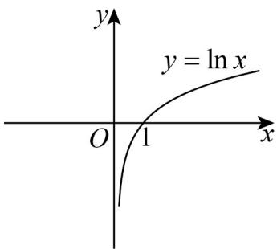
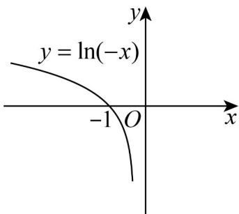
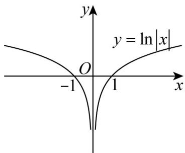
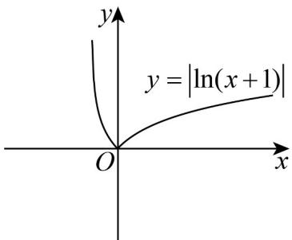

> [!faq]- 《专题02 对数及对数函数的六大常考题型（高效培优专项训练）》官方解析
>
> > [!success]- **【答案】** BCD
>
> > [!note]- **【解析】**
> > 函数 $f(x) = \ln x$ 的图象如下：
> >
> > 
> >
> > 对于 $\mathsf{A}$ ，由函数图象变换可知， $y = \ln (-x)$ 图像如下：
> >
> > 
> >
> > 函数图象与原函数图象关于 $y$ 轴对称，故 $\mathsf{A}$ 错误；
> >
> > 对于 $\mathsf{B}$ ，由函数图象变换可知， $f(|x|)$ 的图象如下：
> >
> > 
> >
> > 函数图象关于 $y$ 轴对称，故 $\mathbf{B}$ 正确；
> >
> > 对于 $C$ ，由函数图象变换可知， $\left|f(x + 1)\right|$ 的图象如下：
> >
> > 
> >
> > 函数图象在 $(0, +\infty)$ 上单调递增，故 $C$ 正确；
> >
> > 对于 D，即 $\left|f\left(\frac{1}{3}\right)\right|=\left|\ln\frac{1}{3}\right|=\ln3$ ， $\left|f(4)\right|=\left|\ln4\right|=\ln4$ ，
> >
> > ∵ $y = \ln x$ 在定义域上单调递增，
> >
> > ∴ $\ln 3 < \ln 4$ ，则 $\left| f\left(\frac{1}{3}\right) \right| < \left| f(4) \right|$ ，故 D 正确；
> >
> > 故选 **BCD**.
