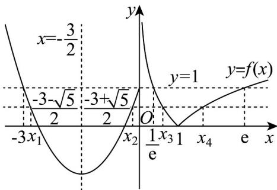

> [!faq]- 《专题02 对数及对数函数的六大常考题型（高效培优专项训练）》官方解析
>
> > [!success]- **【答案】** A. $x_1 + x_2 = -\frac{3}{2}$ , $x_3 + x_4 = 1$ B. $x_1 + x_2 = -3$ , $x_3x_4 = 1$ C. $x_1 + x_2 + x_3 + x_4$ 的取值范围是 $\left(-1, -3 + e + \frac{1}{e}\right]$ D. $x_1x_2 + x_3x_4$ 的取值范围是 $\left(1, \frac{13}{4}\right]$
>
> > [!note]- **【解析】**
> > 如图，作出函数 $f(x)$ 的图象，
> >
> > 
> >
> > 的对称轴为，则
> >
> > $$
> > y = x ^ {2} + 3 x + 1
> > $$
> >
> > $$
> > x = - \frac {3}{2}
> > $$
> >
> > $$
> > x _ {1} + x _ {2} = - 3
> > $$
> >
> > 令 $x^{2} + 3x + 1 = 1$ ，解得 $x = -3$ 或 $x = 0$
> >
> > 令 $x^{2} + 3x + 1 = 0$ ，解得 $x = \frac{-3 - \sqrt{5}}{2}$ 或 $x = \frac{-3 + \sqrt{5}}{2}$
> >
> > $\left|\ln x_{3}\right|=\left|\ln x_{4}\right|$ ，即 $-\ln x_{3}=\ln x_{4}$ ，则 $\ln x_{3}+\ln x_{4}=\ln\left(x_{3}x_{4}\right)=0$ ，可得 $x_{3}x_{4}=1$ ，
> >
> > 令 $|\ln x| = 1$ ，解得 $x = \frac{1}{\mathrm{e}}$ 或 $x = \mathrm{e}$
> >
> > 综上所述： $-3 \leq x_{1} < \frac{-3 - \sqrt{5}}{2}, \frac{-3 + \sqrt{5}}{2} < x_{2} \leq 0, \frac{1}{\mathrm{e}} \leq x_{3} < 1 < x_{4} \leq \mathrm{e}$ ， $x_{1} + x_{2} = -3$ ， $x_{3}x_{4} = 1$
> >
> > 故 $^{A}$ 错误， $^{B}$ 正确；
> >
> > 对于选项 C：可得 $x_{4}=\frac{1}{x_{3}}$ ， $x_{3}\in\left[\frac{1}{e},1\right)$
> >
> > 则 $x_{1} + x_{2} + x_{3} + x_{4} = -3 + x_{3} + \frac{1}{x_{3}}$
> >
> > 因为 $g(x) = -3 + x + \frac{1}{x}$ 在 $\left[\frac{1}{\mathrm{e}}, 1\right)$ 上为单调递减函数，且 $g\left(\frac{1}{\mathrm{e}}\right) = -3 + \mathrm{e} + \frac{1}{\mathrm{e}}$ ， $g(1) = -1$
> >
> > 所以 $x_{1} + x_{2} + x_{3} + x_{4}$ 的取值范围是 $\left(-1, - 3 + \mathrm{e} + \frac{1}{\mathrm{e}}\right]$ ，故C正确；
> >
> > 对于选项D：可得 $x_{1} = -3 - x_{2}$ ， $x_{2}\in \left(\frac{-3 + \sqrt{5}}{2},0\right]$
> >
> > $$
> > x _ {1} x _ {2} + x _ {3} x _ {4} = (- 3 - x _ {2}) x _ {2} + 1 = - \left(x _ {2} + \frac {3}{2}\right) ^ {2} + \frac {1 3}{4}
> > $$
> >
> > 因为 $h(x) = -\left(x + \frac{3}{2}\right)^2 + \frac{13}{4}$ 在 $\left(\frac{-3 + \sqrt{5}}{2}, 0\right]$ 上为单调递减函数，
> >
> > 且 $h\left(\frac{-3 + \sqrt{5}}{2}\right) = 2$ ， $h(0) = 1$
> >
> > 所以 $x_{1}x_{2} + x_{3}x_{4}$ 的取值范围是 $[1,2)$ ，故 D 错误；
> >
> > 故选 **BC**.
