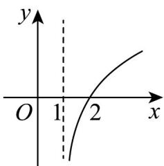
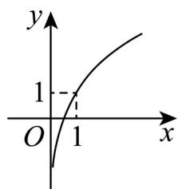
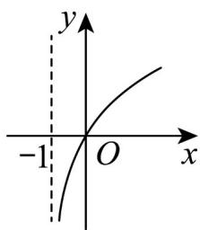
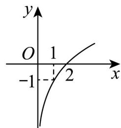

> [!faq]- 《专题02 对数及对数函数的六大常考题型（高效培优专项训练）》官方解析
>
> > [!success]- **【答案】** A  B  C  D 
>
> > [!note]- **【解析】**
> > 由题意函数 $g(x)$ 与函数 $f(x) = 2^{x} + 1$ 互为反函数，
> >
> > 所以 $x = 2^{g(x)} + 1$ ，解得 $g(x) = \log_2(x - 1)$ ，它在定义域 $(1, + \infty)$ 内单调递增，且过定点 $(2,0)$
> >
> > 对比选项可知 $^{A}$ 符合题意·
> >
> > 故选 **A**.
