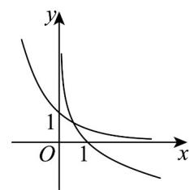
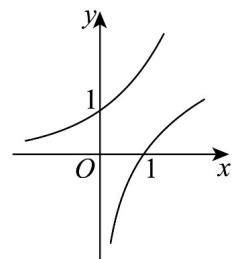
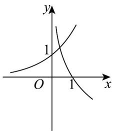
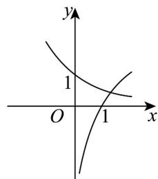

> [!faq]- 《专题02 对数及对数函数的六大常考题型（高效培优专项训练）》官方解析
>
> > [!success]- **【答案】** A  B  C  D 
>
> > [!note]- **【解析】**
> > 由题意若 $0 < a < 1$ ，则指数函数 $y = a^{-x} = \left(\frac{1}{a}\right)^x$ 单调递增，并过定点 $(0,1)$ ，函数 $y = \log_a x$ 单调递减，并过定点 $(1,0)$ ，而函数 $y = -\log_a x$ 与函数 $y = \log_a x$ 关于 $x$ 轴对称，所以 $y = -\log_a x$ 单调递增，并过定点 $(1,0)$ ，对比选项可知，只有 B 选项符合题意。
> >
> > 故选：B.
> >
> > 32. 函数 $y = \log_{a} x + a^{x-1} + 2$ (a > 0 且 $a \neq 1$ ) 的图象恒过定点 $(k, b)$ ，若 $m + n = b - k$ 且 m > 0，n > 0，则 $\frac{9n+m}{mn}$ 的最小值为（）A.9 B.8 C. $\frac{9}{2}$ D. $\frac{5}{2}$
> >
> > 【答案】B
> >
> > 【详解】当 $x = 1$ 时， $y = \log_a 1 + a^{1 - 1} + 2 = 3$
> >
> > 所以，函数 $y = \log_{a} x + a^{x-1} + 2$ 过定点 $(1,3)$ ，得 k = 1, b = 3，
> >
> > 所以， $m + n = 3 - 1 = 2$
> >
> > 因为 $m > 0$ ， $n > 0$
> >
> > 所以， $\frac{9n + m}{mn} = \frac{9}{m} +\frac{1}{n} = \frac{1}{2}\left(\frac{9}{m} +\frac{1}{n}\right)(m + n) = \frac{1}{2}\left(10 + \frac{9n}{m} +\frac{m}{n}\right)\quad \frac{1}{2}\left(10 + 2\sqrt{9}\right) = 8$
> >
> > 当且仅当 $\left\{\begin{aligned}\frac{9n}{m}&=\frac{m}{n}\\ m+n&=2\end{aligned}\right.$ ，即 $m=\frac{3}{2}, n=\frac{1}{2}$ 时，等号成立，
> >
> > 所以， $\frac{9n+m}{mn}$ 的最小值为8.
> >
> > 故选 **B**
