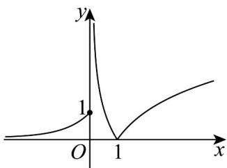

> [!faq]- 《专题03 函数的应用（二）的四大常考题型（高效培优专项训练）》官方解析
>
> > [!success]- **【答案】** A. $\left(\frac{1}{2}, 1\right]$ B. $\left(\frac{1}{2}, \frac{3}{2}\right]$ C. $\left(0, \frac{3}{2}\right]$ D. $\left(1, \frac{3}{2}\right]$
>
> > [!note]- **【解析】**
> > 当 $x > 0$ 时， $y = \left|\log_2 x\right|$ ；当 $x \leq 0$ 时， $y = 3^x \in (0,1]$
> >
> > 作函数的图象可得，
> >
> > 
> >
> > 令 $t = f(x)$ ，则 $g(x) = t^2 - 2(m + 2)t + 4m$
> >
> > 当 $t < 0$ 时，方程 $f(x) = t$ 没有解，
> >
> > 当 $t = 0$ 时，方程 $f(x) = t$ 有一个解，
> >
> > 当 $t > 1$ 时，方程 $f(x) = t$ 有两个解，
> >
> > 当 $0 < t \leq 1$ 时，方程 $f(x) = t$ 有三个解，
> >
> > 因为 $g(x)$ 恰有5个零点，
> >
> > 所以 $t^2 - 2(m + 2)t + 4m = 0$ 有两个根 $t_1, t_2$ （不妨设 $t_1 \leq t_2$ ）
> >
> > 所以 $4(m + 2)^{2} - 16m = 4m^{2} + 16 > 0$
> >
> > 由韦达定理可得 $t_1 + t_2 = 2(m + 2), t_1 t_2 = 4m$
> >
> > 要使 $g(x)$ 有 $5$ 个零点，则需满足 $\left\{ \begin{array}{l}0 < t_1 \leq 1 \\ t_2 > 1 \end{array} \right.$
> >
> > 设 $h(t) = t^2 - 2(m + 2)t + 4m$ ，则 $\left\{ \begin{array}{l} h(0) = 4m > 0 \\ h(1) = 1 - 2(m + 2) + 4m \leq 0 \\ 2(m + 2) > 1 \end{array} \right.$ ，则
> >
> > 解得 $0 < m \leq \frac{3}{2}$
> >
> > 所以实数 $m$ 的取值范围是 $\left(0, \frac{3}{2}\right]$ .
> >
> > 故选 **C**.
