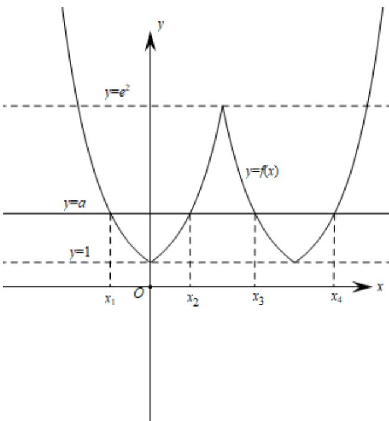

> [!faq]- 《专题03 函数的应用（二）的四大常考题型（高效培优专项训练）》官方解析
>
> > [!success]- **【答案】** C
>
> > [!note]- **【解析】**
> > 函数 $f(x) = \begin{cases} e^{|x|}, x, 2 \\ f(4 - x), x > 2 \end{cases}$ 即为 $f(x) = \begin{cases} e^{|x|}, x \leq 2 \\ e^{|x - 4|}, x > 2 \end{cases}$ ，其图象如图所示：
> >
> > 
> >
> > 因为方程 $f(x) - a = 0$ 有四个不相等的实数根 $x_{1}, x_{2}, x_{3}, x_{4}$ ，且 $x_{1} < x_{2} < x_{3} < x_{4}$
> >
> > 由图象知： $e^{|x_1|} = a, e^{|x_2|} = a, e^{|x_3 - 4|} = a, e^{|x_4 - 4|} = a$ ，且 $1 < a < e^2$
> >
> > 则 $x_{1} = -\ln a, x_{2} = \ln a, x_{3} = -\ln a + 4, x_{4} = \ln a + 4$
> >
> > 所以 $x_{1} + 2x_{2} + 3x_{3} + 4x_{4} = 2\ln a + 28$
> >
> > 因为 $y = 2 \ln a + 28$ 在 $\left(1, e^{2}\right)$ 上递增，
> >
> > 所以 $x_{1}+2x_{2}+3x_{3}+4x_{4}\in(28,32)$
> >
> > 故选 **C**
