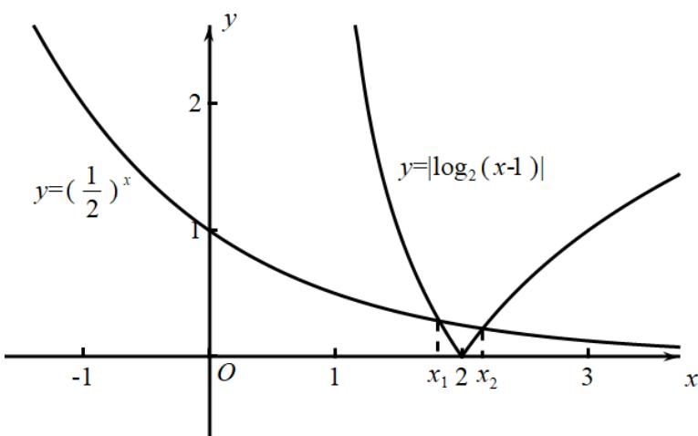

> [!faq]- 《专题03 函数的应用（二）的四大常考题型（高效培优专项训练）》官方解析
>
> > [!success]- **【答案】** B
>
> > [!note]- **【解析】**
> > 因为实数 $x_{1}, x_{2}$ 为函数 $f(x) = \left(\frac{1}{2}\right)^{x} - \left|\log_{2}(x - 1)\right|$ 的两个零点，
> >
> > 所以实数 $x_{1}, x_{2}$ 为 $y = \left(\frac{1}{2}\right)^{x}$ 与 $y = \left|\log_{2}(x - 1)\right|$ 图象交点的横坐标，
> >
> > 作出函数 $y = \left(\frac{1}{2}\right)^x$ 与 $y = \left|\log_2(x - 1)\right|$ 的图象如图所示，
> >
> > 
> >
> > 不妨设 $x_{1} <   x_{2}$
> >
> > 由图像可知， $x_{1}<2,x_{2}>2$ ，所以 $(x_{1}-2)(x_{2}-2)<0$ ，故选项A错误；
> >
> > 由图像可知， $\left\{ \begin{array}{l} \left( \frac{1}{2} \right)^{x_1} = -\log_2(x_1 - 1) \\ \left( \frac{1}{2} \right)^{x_2} = \log_2(x_2 - 1) \end{array} \right.$
> >
> > 所以 $x_{1} - 1 = 2^{-\left(\frac{1}{2}\right)^{x_{1}}}, x_{2} - 1 = 2^{\left(\frac{1}{2}\right)^{x_{2}}}$ ，故 $(x_{1} - 1)(x_{2} - 1) = 2^{\left(\frac{1}{2}\right)^{x_{2}} - \left(\frac{1}{2}\right)^{x_{1}}}$ ，
> >
> > 又因为 $\left(\frac{1}{2}\right)^{x_2} - \left(\frac{1}{2}\right)^{x_1} < 0$ ，所以 $2^{\left(\frac{1}{2}\right)^{x_2} - \left(\frac{1}{2}\right)^{x_1}} < 1$ ，所以 $0 < (x_1 - 1)(x_2 - 1) < 1$ ，故 B 正确，C、D 错误。
> >
> > 故选 **B**.
