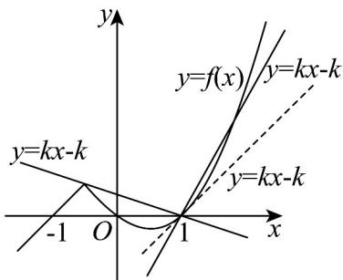

> [!faq]- 《专题03 函数的应用（二）的四大常考题型（高效培优专项训练）》官方解析
>
> > [!success]- **【答案】** A. [1, +∞) B. Ê 1/3, 1 Ê (1, +Y) C. [-1/3, 1) D. [1/3, 1)
>
> > [!note]- **【解析】**
> > 关于 $x$ 的方程 $f(x) = kx - k$ 至少有两个不相等的实数根，
> >
> > 则直线 $y = kx - k$ 与 $y = x^2 - x$ 的图象至少两个不同的交点，
> >
> > 作出函数 $f(x)$ 的图象如下，直线 $y = kx - k$ 恒过 $(1,0)$ ，
> >
> > 
> >
> > 当直线 $y = kx - k$ 与 $y = x^{2} - x$ 相切时， $x^{2} - (k + 1)x + k = 0$
> >
> > 由 $\Delta = (k + 1)^2 - 4k = 0$ 可得 $k = 1$ ，此时 $y = x - 1$ 与 $f(x) = x + 1$ 平行，
> >
> > 所以此时方程 $f(x) = kx - k$ 只有一个根，不合题意；
> >
> > 当 $k > 1$ 时， $y = kx - k$ 与 $y = x^2 - x$ 有两个交点，符合题意；
> >
> > 当 $0 \leq k < 1$ 时， $y = kx - k$ 与 $y = f(x)$ 有三个交点，符合题意；
> >
> > 当 $k < 0$ 时， $y = kx - k$ 经过点 $\left(-\frac{1}{2}, \frac{1}{2}\right)$ 时， $y = kx - k$ 与 $y = f(x)$ 有两个交点，
> >
> > 此时 $k = -\frac{1}{3}$ ，若 $-\frac{1}{3} < k < 0$ ， $y = kx - k$ 与 $y = f(x)$ 有三个交点，
> >
> > 综上可知，方程 $f(x)=kx-k$ 至少有两个不相等的实数根，实数 k 的取值范围为 $\left[-\frac{1}{3},1\right)\cup(1,+\infty)$ .
> >
> > 故选 **B**.
